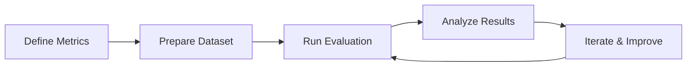

# Evaluation & Testing Overview

Evaluation is critical for building reliable generative AI applications. This guide introduces evaluation concepts, metrics, and best practices for testing AI systems on Google Cloud.

## Why Evaluation Matters

Evaluation helps you:

- **Measure quality**: Quantify how well your AI performs against requirements
- **Compare models**: Make data-driven decisions when selecting or migrating models
- **Track improvements**: Monitor performance as you iterate on prompts and configurations
- **Ensure reliability**: Detect issues like hallucinations, toxicity, and bias
- **Build trust**: Provide evidence that your system works as intended

## Evaluation Approaches

### Model-Based Evaluation

Use AI models to evaluate AI outputs. Model-based metrics assess qualities like coherence, fluency, and safety.

<Note>
Model-based metrics use language models as judges to evaluate responses according to predefined rubrics.
</Note>

**Common model-based metrics:**

- **Coherence**: Logical flow and consistency of responses
- **Fluency**: Natural language quality and readability
- **Safety**: Detection of harmful or toxic content
- **Groundedness**: Alignment with provided context
- **Instruction following**: Adherence to prompt requirements

### Reference-Based Evaluation

Compare model outputs against golden reference answers using statistical metrics.

**Common reference-based metrics:**

- **ROUGE**: Measures overlap with reference text (recall-focused)
- **BLEU**: Measures n-gram precision against references
- **Exact Match**: Binary score for perfect matches

### Computation-Based Evaluation

Apply deterministic algorithms to evaluate specific properties.

**Examples:**

- **Tool call validation**: Verify function calling correctness
- **Schema compliance**: Check JSON structure validity
- **Length constraints**: Measure response verbosity

## Core Evaluation Concepts

### Datasets

Evaluation requires well-structured datasets:

```python
import pandas as pd

eval_dataset = pd.DataFrame({
    "prompt": [
        "Summarize the benefits of cloud computing",
        "Explain machine learning to a beginner"
    ],
    "reference": [
        "Cloud computing provides scalability, cost savings, and flexibility",
        "Machine learning teaches computers to learn from data"
    ]
})
```

<Note>
For best results, use at least 100 examples. More examples provide statistically significant metrics.
</Note>

### Metrics

Metrics quantify different aspects of quality:

<CardGroup cols={2}>
  <Card title="Model-Based" icon="robot">
    Assess subjective qualities like helpfulness and relevance using AI judges
  </Card>
  <Card title="Reference-Based" icon="ruler">
    Compare outputs to ground truth using statistical measures
  </Card>
  <Card title="Custom Metrics" icon="wrench">
    Define domain-specific evaluation criteria for your use case
  </Card>
  <Card title="Computation-Based" icon="calculator">
    Apply deterministic rules and algorithms
  </Card>
</CardGroup>

### Experiments

Organize evaluations into experiments to track and compare results:

```python
from vertexai.evaluation import EvalTask

eval_task = EvalTask(
    dataset=eval_dataset,
    metrics=["coherence", "fluency", "safety"],
    experiment="my-experiment"
)

results = eval_task.evaluate()
```

## Evaluation Frameworks

### EvalTask API

The traditional approach for model evaluation:

```python
from vertexai.evaluation import EvalTask

eval_task = EvalTask(
    dataset=eval_dataset,
    metrics=["bleu", "rouge", "coherence"],
    experiment="summarization-eval"
)

result = eval_task.evaluate(model=model)
```

**Use EvalTask for:**
- Model comparison and selection
- Prompt engineering evaluation
- RAG system assessment

### Gen AI Evaluation Service SDK

The modern SDK for comprehensive evaluation:

```python
from vertexai import Client
from vertexai import types

client = Client(project=PROJECT_ID, location=LOCATION)

evaluation_run = client.evals.create_evaluation_run(
    dataset=dataset,
    metrics=[
        types.RubricMetric.COHERENCE,
        types.RubricMetric.FLUENCY
    ]
)
```

**Use Gen AI Eval SDK for:**
- Agent evaluation with traces
- Persistent evaluation runs
- Advanced visualizations

## Best Practices

<Steps>
  <Step title="Start with clear objectives">
    Define what "good" means for your specific use case before selecting metrics.
  </Step>
  
  <Step title="Use multiple metrics">
    No single metric captures all aspects of quality. Combine metrics for comprehensive assessment.
  </Step>
  
  <Step title="Build quality datasets">
    Invest in diverse, representative evaluation datasets with at least 100 examples.
  </Step>
  
  <Step title="Establish baselines">
    Measure initial performance before making changes to track improvements.
  </Step>
  
  <Step title="Iterate and refine">
    Use evaluation results to guide prompt engineering and model selection decisions.
  </Step>
</Steps>

## Evaluation Workflow



1. **Define metrics**: Select appropriate metrics for your use case
2. **Prepare dataset**: Create evaluation examples with prompts and references
3. **Run evaluation**: Execute evaluation using chosen framework
4. **Analyze results**: Review metrics and identify areas for improvement
5. **Iterate**: Refine prompts, models, or configurations based on insights

## Common Evaluation Scenarios

### Text Generation

- **Metrics**: coherence, fluency, text_quality
- **Focus**: Natural language quality and readability

### Question Answering

- **Metrics**: question_answering_quality, groundedness, relevance
- **Focus**: Accuracy and context alignment

### Summarization

- **Metrics**: summarization_quality, rouge, verbosity
- **Focus**: Information coverage and conciseness

### RAG Applications

- **Metrics**: groundedness, relevance, hallucination
- **Focus**: Context utilization and factuality

### Agent Systems

- **Metrics**: tool_use_quality, final_response_quality, hallucination
- **Focus**: Tool calling accuracy and response quality

## Next Steps

<CardGroup cols={2}>
  <Card title="Gen AI Eval SDK" icon="code" href="/advanced/evaluation/gen-ai-eval">
    Learn about the modern evaluation SDK with predefined metrics
  </Card>
  <Card title="Agent Evaluation" icon="robot" href="/advanced/evaluation/agent-evaluation">
    Evaluate agentic systems with tool use and traces
  </Card>
  <Card title="Model Migration" icon="shuffle" href="/advanced/evaluation/model-migration">
    Compare models to make informed migration decisions
  </Card>
  <Card title="View Evaluation Results" icon="chart-line" href="https://cloud.google.com/vertex-ai/generative-ai/docs/models/view-evaluation">
    Visualize and analyze evaluation reports
  </Card>
</CardGroup>

## Additional Resources

- [Vertex AI Evaluation Overview](https://cloud.google.com/vertex-ai/generative-ai/docs/models/evaluation-overview)
- [Determine Your Evaluation Metrics](https://cloud.google.com/vertex-ai/generative-ai/docs/models/determine-eval)
- [Evaluation Quotas](https://cloud.google.com/vertex-ai/generative-ai/docs/quotas#eval-quotas)