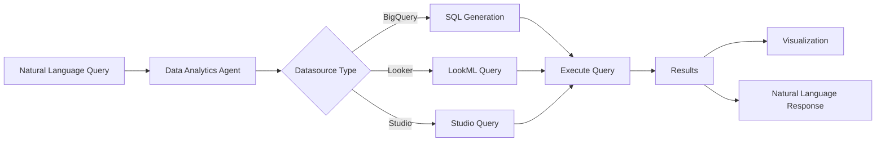

## Overview

Gemini for Data Analytics (Conversational Analytics API) enables natural language interactions with your data. Ask questions in plain English and get SQL queries, visualizations, and insights from BigQuery and Looker data sources.

**Key capabilities:**
- **Natural language to SQL**: "Show me sales by region" → automatic SQL generation
- **Multi-datasource**: Query BigQuery tables, Looker explores, and Looker Studio simultaneously
- **Automatic visualization**: Generate charts and graphs from query results
- **Conversation memory**: Follow-up questions maintain context
- **Clarification prompts**: Agent asks for clarification when needed

<Note>
Gemini for Data Analytics is currently in Pre-GA. Provide feedback to conversational-analytics-api-feedback@google.com
</Note>

## Architecture



## Quick Start

<Steps>
  <Step title="Enable APIs">
    Required APIs for your Google Cloud project:
    - [Cloud AI Companion API](https://console.cloud.google.com/apis/library/cloudaicompanion.googleapis.com)
    - [Gemini Data Analytics API](https://console.cloud.google.com/apis/library/geminidataanalytics.googleapis.com)
    - [BigQuery API](https://console.cloud.google.com/marketplace/product/google/bigquery.googleapis.com)
    - [Vertex AI API](https://console.cloud.google.com/apis/library/aiplatform.googleapis.com)
  </Step>
  
  <Step title="Install Client Library">
    ```bash
    pip install google-cloud-geminidataanalytics
    ```
  </Step>
  
  <Step title="Authenticate">
    ```python
    from google.colab import auth
    auth.authenticate_user()
    ```
    
    Or for non-Colab environments:
    ```bash
    gcloud auth application-default login
    ```
  </Step>
  
  <Step title="Create Your First Agent">
    ```python
    from google.cloud import geminidataanalytics_v1beta as gda
    
    client = gda.DataAgentServiceClient()
    
    # Configure BigQuery datasource
    bq_reference = gda.BigQueryTableReference(
        project_id="bigquery-public-data",
        dataset_id="faa",
        table_id="us_airports",
    )
    
    # Create data agent
    agent = client.create_data_agent(
        parent=f"projects/{PROJECT_ID}/locations/global",
        data_agent_id="airports_agent",
        data_agent=gda.DataAgent(
            data_analytics_agent=gda.DataAnalyticsAgent(
                published_context=gda.Context(
                    system_instruction="You are an aviation data analyst",
                    datasource_references=gda.DatasourceReferences(
                        bq=gda.BigQueryTableReferences(
                            table_references=[bq_reference]
                        )
                    ),
                )
            )
        ),
    )
    ```
  </Step>
  
  <Step title="Ask Questions">
    ```python
    chat_client = gda.DataChatServiceClient()
    
    # Create conversation
    conversation = chat_client.create_conversation(
        parent=f"projects/{PROJECT_ID}/locations/global",
        conversation=gda.Conversation(
            agents=[agent.name]
        ),
    )
    
    # Ask a question
    response = chat_client.generate_message(
        conversation=conversation.name,
        messages=[gda.Message(
            user_message=gda.UserMessage(
                text="How many airports are in California?"
            )
        )],
    )
    
    # Process response
    for msg in response.messages:
        if msg.system_message.data:
            # SQL was generated and executed
            print("Generated SQL:", msg.system_message.data.generated_sql)
            print("Results:", msg.system_message.data.result.data)
    ```
  </Step>
</Steps>

## Data Sources

### BigQuery Tables

<CodeGroup>
```python Single Table
bq_reference = gda.BigQueryTableReference(
    project_id="bigquery-public-data",
    dataset_id="faa",
    table_id="us_airports",
)

datasource_refs = gda.DatasourceReferences(
    bq=gda.BigQueryTableReferences(
        table_references=[bq_reference]
    )
)
```

```python Multiple Tables
airports_ref = gda.BigQueryTableReference(
    project_id="bigquery-public-data",
    dataset_id="faa",
    table_id="us_airports",
)

flights_ref = gda.BigQueryTableReference(
    project_id="bigquery-public-data",
    dataset_id="faa",
    table_id="us_flights",
)

datasource_refs = gda.DatasourceReferences(
    bq=gda.BigQueryTableReferences(
        table_references=[airports_ref, flights_ref]
    )
)
```

```python With Example Queries
# Provide examples to improve SQL generation
example_queries = [
    gda.ExampleQuery(
        natural_language_question="How many airports are there?",
        sql_query="SELECT COUNT(*) FROM `bigquery-public-data.faa.us_airports`",
    ),
    gda.ExampleQuery(
        natural_language_question="Show me major airports in California",
        sql_query="""SELECT code, city, name 
            FROM `bigquery-public-data.faa.us_airports` 
            WHERE state = 'CA' AND major = 'Y'""",
    ),
]

context = gda.Context(
    system_instruction="You are an aviation analyst",
    datasource_references=datasource_refs,
    example_queries=example_queries,
)
```

```python With Glossary
# Define business terms for better understanding
glossary_terms = [
    gda.GlossaryTerm(
        display_name="Airport Code",
        description="3-character IATA code (e.g., 'JFK' for New York)",
        labels=["code", "IATA", "identifier"],
    ),
    gda.GlossaryTerm(
        display_name="Major Airport",
        description="Airports with high passenger traffic (major='Y')",
        labels=["hub", "major"],
    ),
]

context = gda.Context(
    system_instruction="You are an aviation analyst",
    datasource_references=datasource_refs,
    glossary_terms=glossary_terms,
)
```
</CodeGroup>

### Looker Explores

<CodeGroup>
```python Public Looker Instance
# Configure Looker datasource
looker_ref = gda.LookerExploreReference(
    looker_instance_uri="https://my-company.looker.com",
    lookml_model="sales",
    explore="orders",
)

# Authentication with client credentials
credentials = gda.Credentials(
    oauth=gda.OAuthCredentials(
        secret=gda.OAuthCredentials.SecretBased(
            client_id="your-client-id",
            client_secret="your-client-secret",
        )
    )
)

datasource_refs = gda.DatasourceReferences(
    looker=gda.LookerExploreReferences(
        explore_references=[looker_ref]
    )
)
```

```python Private Looker Instance
looker_ref = gda.LookerExploreReference(
    private_looker_instance_info=gda.PrivateLookerInstanceInfo(
        looker_instance_id="your-instance-id",
        service_directory_name="your-service-directory",
    ),
    lookml_model="sales",
    explore="orders",
)

# Authentication with access token
credentials = gda.Credentials(
    oauth=gda.OAuthCredentials(
        token=gda.OAuthCredentials.TokenBased(
            access_token="your-access-token"
        )
    )
)
```

```python With Golden Queries
# Provide example Looker queries
golden_queries = [
    gda.LookerGoldenQuery(
        natural_language_questions=[
            "What are the major airport codes in CA?",
        ],
        looker_query=gda.LookerQuery(
            model="airports",
            explore="airports",
            fields=["airports.city", "airports.code"],
            filters=[
                gda.LookerQuery.Filter(
                    field="airports.major",
                    value="Y"
                ),
                gda.LookerQuery.Filter(
                    field="airports.state",
                    value="CA"
                ),
            ],
        ),
    ),
]

context = gda.Context(
    datasource_references=datasource_refs,
    looker_golden_queries=golden_queries,
)
```
</CodeGroup>

### Looker Studio

```python
studio_ref = gda.StudioDatasourceReference(
    datasource_id="your-studio-datasource-id"
)

datasource_refs = gda.DatasourceReferences(
    studio=gda.StudioDatasourceReferences(
        studio_references=[studio_ref]
    )
)
```

## System Instructions

Provide context to improve answer quality:

### Basic Instruction

```python
system_instruction = "You are a sales analyst for an e-commerce company. Always include percentages and comparisons to previous periods."

context = gda.Context(
    system_instruction=system_instruction,
    datasource_references=datasource_refs,
)
```

### Advanced YAML Template

For complex schemas, use YAML format:

```python
system_instruction = """
- system_instruction: >
    You are an expert sales analyst for Acme Corp e-commerce store.
    
- tables:
    - table:
        - name: acme.sales.orders
        - description: Orders from the e-commerce store
        - synonyms: [sales, transactions]
        - tags: [sale, order, revenue]
        - fields:
            - field:
                - name: order_id
                - description: Unique identifier for each order
            - field:
                - name: customer_id
                - description: Unique customer identifier
            - field:
                - name: status
                - description: Order status
                - sample_values: [complete, shipped, returned, pending]
            - field:
                - name: total_amount
                - description: Total order value in USD
                - aggregations: [sum, avg, max, min]
            - field:
                - name: created_at
                - description: Order creation timestamp
        - measures:
            - measure:
                - name: revenue
                - description: Total revenue (sum of total_amount)
                - exp: SUM(total_amount)
        - golden_queries:
            - golden_query:
                - natural_language_query: What were total sales last month?
                - sql_query: >
                    SELECT SUM(total_amount) as revenue
                    FROM acme.sales.orders
                    WHERE created_at >= DATE_SUB(CURRENT_DATE(), INTERVAL 1 MONTH)
                    AND status = 'complete'
                    
- glossaries:
    - glossary:
        - term: Revenue
        - description: Total value of completed orders
        - synonyms: [sales, income, earnings]
    - glossary:
        - term: Conversion Rate
        - description: Percentage of visitors who make a purchase
        - synonyms: [CVR, conversion]
        
- additional_descriptions:
    - text: All monetary values are in USD unless specified otherwise.
    - text: Fiscal year starts in April.
"""
```

## Conversation Patterns

### Stateful Conversations

Create conversations that maintain context:

```python
chat_client = gda.DataChatServiceClient()

# Create conversation
conversation = chat_client.create_conversation(
    parent=f"projects/{PROJECT_ID}/locations/global",
    conversation_id="sales_analysis_1",
    conversation=gda.Conversation(
        agents=[agent.name]
    ),
)

# First question
response1 = chat_client.generate_message(
    conversation=conversation.name,
    messages=[gda.Message(
        user_message=gda.UserMessage(
            text="Show me sales by region for Q4 2024"
        )
    )],
)

# Follow-up question (context maintained)
response2 = chat_client.generate_message(
    conversation=conversation.name,
    messages=[gda.Message(
        user_message=gda.UserMessage(
            text="Now compare that to Q4 2023"  # "that" refers to previous query
        )
    )],
)

# Another follow-up
response3 = chat_client.generate_message(
    conversation=conversation.name,
    messages=[gda.Message(
        user_message=gda.UserMessage(
            text="Show it as a bar chart"  # "it" refers to the comparison
        )
    )],
)
```

### Handling Different Response Types

```python
def handle_response(response):
    for msg in response.messages:
        system_msg = msg.system_message
        
        # Text response
        if system_msg.text:
            print("Text:", system_msg.text.parts)
        
        # Schema information
        elif system_msg.schema:
            print("Schema resolved:")
            for datasource in system_msg.schema.result.datasources:
                print(f"  Table: {datasource.bigquery_table_reference.table_id}")
        
        # Data query results
        elif system_msg.data:
            if system_msg.data.generated_sql:
                print("SQL:", system_msg.data.generated_sql)
            
            if system_msg.data.result:
                # Convert to pandas DataFrame
                import pandas as pd
                
                fields = [f.name for f in system_msg.data.result.schema.fields]
                rows = [{f: row[f] for f in fields} for row in system_msg.data.result.data]
                df = pd.DataFrame(rows)
                print(df)
        
        # Chart visualization
        elif system_msg.chart:
            import altair as alt
            import json
            
            # Render Vega-Lite chart
            vega_config = system_msg.chart.result.vega_config
            chart = alt.Chart.from_dict(dict(vega_config))
            chart.display()
        
        # Clarification needed
        elif system_msg.clarification:
            print("Please clarify:")
            for question in system_msg.clarification.questions:
                print(f"  {question.question}")
                for option in question.options:
                    print(f"    - {option}")

handle_response(response)
```

### Streaming Responses

```python
stream = chat_client.generate_message_stream(
    conversation=conversation.name,
    messages=[gda.Message(
        user_message=gda.UserMessage(
            text="Analyze sales trends over the past year"
        )
    )],
)

for chunk in stream:
    for msg in chunk.messages:
        if msg.system_message.text:
            print(msg.system_message.text.parts, end="", flush=True)
```

## Inline Context (Stateless)

For one-off queries without creating agents:

```python
chat_client = gda.DataChatServiceClient()

# Define context inline
inline_context = gda.Context(
    system_instruction="You are a data analyst",
    datasource_references=datasource_refs,
)

# Generate response without creating agent or conversation
response = chat_client.generate_message(
    inline_context=inline_context,
    messages=[gda.Message(
        user_message=gda.UserMessage(
            text="How many airports are in Texas?"
        )
    )],
)
```

## Advanced Options

### Python Code Execution

Enable advanced analysis with Python:

```python
context = gda.Context(
    system_instruction="You are a data scientist",
    datasource_references=datasource_refs,
    options=gda.ConversationOptions(
        analysis=gda.AnalysisOptions(
            python=gda.AnalysisOptions.Python(
                enabled=True  # Enable Python for complex calculations
            )
        )
    ),
)

# Agent can now use Python for:
# - Statistical analysis
# - Data transformations
# - Complex calculations
# - Custom visualizations
```

### Custom Visualization Settings

```python
response = chat_client.generate_message(
    conversation=conversation.name,
    messages=[gda.Message(
        user_message=gda.UserMessage(
            text="Create a line chart of monthly sales with a trend line"
        )
    )],
    visualization_config=gda.VisualizationConfig(
        chart_type="line",
        show_legend=True,
        theme="dark",
    ),
)
```

## Real-World Examples

### Sales Analytics Agent

<CodeGroup>
```python Setup
from google.cloud import geminidataanalytics_v1beta as gda

client = gda.DataAgentServiceClient()
chat_client = gda.DataChatServiceClient()

# Multi-table BigQuery setup
orders_ref = gda.BigQueryTableReference(
    project_id="my-project",
    dataset_id="sales",
    table_id="orders",
)

customers_ref = gda.BigQueryTableReference(
    project_id="my-project",
    dataset_id="sales",
    table_id="customers",
)

# System instruction with business context
system_instruction = """You are a sales analyst for Acme Corp.

When analyzing sales:
- Always segment by customer tier (enterprise, mid-market, smb)
- Compare YoY and QoQ trends
- Flag anomalies (>20% deviation from average)
- Include profit margins, not just revenue

Fiscal year starts in April."""

# Create agent
agent = client.create_data_agent(
    parent=f"projects/{PROJECT_ID}/locations/global",
    data_agent_id="sales_analyst",
    data_agent=gda.DataAgent(
        data_analytics_agent=gda.DataAnalyticsAgent(
            published_context=gda.Context(
                system_instruction=system_instruction,
                datasource_references=gda.DatasourceReferences(
                    bq=gda.BigQueryTableReferences(
                        table_references=[orders_ref, customers_ref]
                    )
                ),
            )
        )
    ),
)
```

```python Query
# Create conversation
conv = chat_client.create_conversation(
    parent=f"projects/{PROJECT_ID}/locations/global",
    conversation=gda.Conversation(agents=[agent.name]),
)

# Complex analytical query
response = chat_client.generate_message(
    conversation=conv.name,
    messages=[gda.Message(
        user_message=gda.UserMessage(
            text="""Show me Q4 2024 revenue by customer tier.
            Compare to Q4 2023 and highlight any tiers with >20% growth.
            Create a bar chart."""
        )
    )],
)

# Agent will:
# 1. Generate SQL joining orders and customers
# 2. Calculate revenue by tier
# 3. Compare YoY
# 4. Identify >20% growth
# 5. Create visualization
# 6. Provide natural language summary
```
</CodeGroup>

### Multi-Datasource Analysis

```python
# Combine BigQuery and Looker
bq_ref = gda.BigQueryTableReference(
    project_id="my-project",
    dataset_id="warehouse",
    table_id="raw_events",
)

looker_ref = gda.LookerExploreReference(
    looker_instance_uri="https://company.looker.com",
    lookml_model="business_intelligence",
    explore="sales_metrics",
)

datasource_refs = gda.DatasourceReferences(
    bq=gda.BigQueryTableReferences(table_references=[bq_ref]),
    looker=gda.LookerExploreReferences(explore_references=[looker_ref]),
)

agent = client.create_data_agent(
    parent=f"projects/{PROJECT_ID}/locations/global",
    data_agent=gda.DataAgent(
        data_analytics_agent=gda.DataAnalyticsAgent(
            published_context=gda.Context(
                system_instruction="""You have access to both raw event data (BigQuery)
                and business metrics (Looker). Use raw data for detailed analysis
                and Looker for standard business metrics.""",
                datasource_references=datasource_refs,
            )
        )
    ),
)

# Query spans both sources
response = chat_client.generate_message(
    inline_context=gda.Context(
        datasource_references=datasource_refs,
    ),
    messages=[gda.Message(
        user_message=gda.UserMessage(
            text="Compare funnel conversion rates from raw events with the aggregated metrics in Looker"
        )
    )],
)
```

## Agent Management

<CodeGroup>
```python List Agents
for agent in client.list_data_agents(
    parent=f"projects/{PROJECT_ID}/locations/global"
):
    print(f"Agent: {agent.name}")
    print(f"  Created: {agent.create_time}")
```

```python Get Agent
agent = client.get_data_agent(
    name=f"projects/{PROJECT_ID}/locations/global/dataAgents/sales_analyst"
)

print(f"System instruction: {agent.data_analytics_agent.published_context.system_instruction}")
```

```python Update Agent
from google.protobuf import field_mask_pb2

# Update system instruction
agent.data_analytics_agent.published_context.system_instruction = "New instruction"

updated = client.update_data_agent(
    data_agent=agent,
    update_mask=field_mask_pb2.FieldMask(
        paths=["data_analytics_agent.published_context.system_instruction"]
    ),
)
```

```python Delete Agent
client.delete_data_agent(
    name=f"projects/{PROJECT_ID}/locations/global/dataAgents/sales_analyst"
)
```
</CodeGroup>

## Conversation Management

```python
# List conversations
for conv in chat_client.list_conversations(
    parent=f"projects/{PROJECT_ID}/locations/global"
):
    print(f"Conversation: {conv.name}")

# Get conversation history
conv = chat_client.get_conversation(
    name="projects/my-project/locations/global/conversations/conv_123"
)

for msg in conv.messages:
    if msg.user_message:
        print(f"User: {msg.user_message.text}")
    elif msg.system_message:
        print(f"Agent: {msg.system_message.text.parts}")

# Delete conversation
chat_client.delete_conversation(
    name="projects/my-project/locations/global/conversations/conv_123"
)
```

## Best Practices

<Steps>
  <Step title="Provide Business Context">
    The more context you provide, the better the SQL generation:
    
    - Define business terms in glossary
    - Provide example queries for common patterns
    - Explain relationships between tables
    - Document sample values for enum fields
  </Step>
  
  <Step title="Use Example Queries">
    Golden queries dramatically improve accuracy:
    
    ```python
    example_queries = [
        gda.ExampleQuery(
            natural_language_question="Show completed orders",
            sql_query="SELECT * FROM orders WHERE status = 'complete'",
        ),
    ]
    ```
  </Step>
  
  <Step title="Leverage Conversations">
    Use stateful conversations for multi-turn analysis:
    
    - Create conversation per analysis session
    - Use follow-up questions to refine
    - Delete conversations when done
  </Step>
  
  <Step title="Handle Clarifications">
    When the agent asks for clarification, provide specific options:
    
    ```python
    if system_msg.clarification:
        # Present options to user
        # Send clarification response
        response = chat_client.generate_message(
            conversation=conv.name,
            messages=[gda.Message(
                user_message=gda.UserMessage(
                    text="Use the orders table"
                )
            )],
        )
    ```
  </Step>
  
  <Step title="Monitor API Usage">
    Track usage through Cloud Monitoring:
    
    - Request counts
    - Latency metrics
    - Error rates
    - Token consumption
  </Step>
</Steps>

## Limitations

<Warning>
- **Pre-GA product**: Features and APIs may change
- **SQL complexity**: Very complex joins may require refinement
- **Looker private instances**: Require Service Directory setup
- **Rate limits**: Subject to standard Vertex AI quotas
</Warning>

## Resources

<CardGroup cols={2}>
  <Card title="API Documentation" href="https://cloud.google.com/gemini/docs/conversational-analytics-api/overview" icon="book">
    Complete API reference
  </Card>
  
  <Card title="HTTP API Example" href="https://github.com/GoogleCloudPlatform/generative-ai/blob/main/agents/gemini_data_analytics/intro_gemini_data_analytics_http.ipynb" icon="code">
    REST API notebook
  </Card>
  
  <Card title="SDK Example" href="https://github.com/GoogleCloudPlatform/generative-ai/blob/main/agents/gemini_data_analytics/intro_gemini_data_analytics_sdk.ipynb" icon="python">
    Python SDK notebook
  </Card>
  
  <Card title="Provide Feedback" href="mailto:conversational-analytics-api-feedback@google.com" icon="envelope">
    Share your experience
  </Card>
</CardGroup>

## Next Steps

<CardGroup cols={2}>
  <Card title="Agent Engine" href="/agents/agent-engine" icon="server">
    Deploy production agents
  </Card>
  
  <Card title="BigQuery" href="https://cloud.google.com/bigquery/docs" icon="database">
    Learn about BigQuery
  </Card>
  
  <Card title="Looker" href="https://cloud.google.com/looker/docs" icon="chart-bar">
    Looker documentation
  </Card>
  
  <Card title="Vertex AI" href="https://cloud.google.com/vertex-ai/docs" icon="google">
    Explore Vertex AI
  </Card>
</CardGroup>