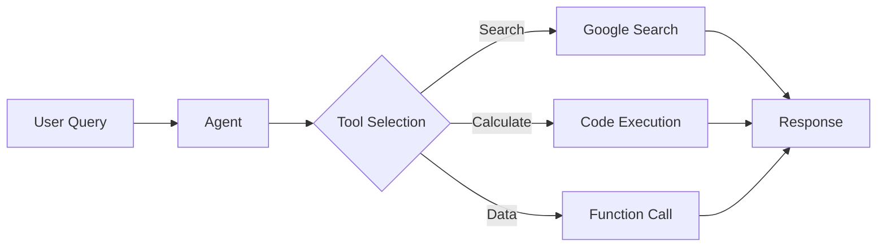
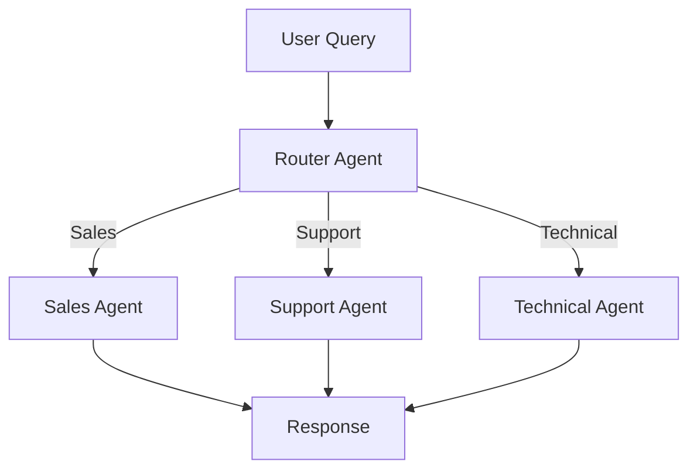

## What are AI Agents?

AI agents are intelligent systems that can perceive their environment, make decisions, and take actions to achieve specific goals. Unlike traditional chatbots that simply respond to queries, agents can:

- **Plan and execute** multi-step tasks autonomously
- **Use tools** to interact with external systems and APIs
- **Maintain memory** across conversations and sessions
- **Reason and adapt** based on context and feedback
- **Collaborate** with other agents in multi-agent systems

<Note>
Agents on Google Cloud leverage Gemini models for reasoning, with built-in support for multimodal inputs (text, images, audio, video) and advanced capabilities like code execution and function calling.
</Note>

## Agent Architecture

A typical AI agent consists of several key components:

<Steps>
  <Step title="LLM Core">
    The reasoning engine (e.g., Gemini 2.5 Flash, Gemini Pro) that processes inputs and makes decisions
  </Step>
  
  <Step title="Tools & Functions">
    External capabilities the agent can invoke, such as:
    - Google Search for real-time information
    - Code execution for data analysis
    - Custom functions for business logic
    - API integrations
  </Step>
  
  <Step title="Memory System">
    Persistent storage for:
    - Conversation history
    - User preferences
    - Long-term knowledge
    - Session state
  </Step>
  
  <Step title="Orchestration Layer">
    Manages the agent's workflow, including:
    - Task planning and decomposition
    - Tool selection and execution
    - Response generation
    - Error handling
  </Step>
</Steps>

### Agent Design Patterns

Google Cloud supports several proven agent design patterns:

<CardGroup cols={2}>
  <Card title="Guardrail Classifier" icon="shield">
    Agents with built-in safety layers that classify and filter potentially harmful inputs or outputs before processing
  </Card>
  
  <Card title="Semantic Router" icon="route">
    Multi-agent systems with intent detection to route requests to specialized expert agents based on user queries
  </Card>
  
  <Card title="Function Calling" icon="code">
    Agents that can invoke external functions and APIs, with streaming capabilities for real-time responses
  </Card>
  
  <Card title="Task Planner" icon="list-check">
    Research and planning agents that generate multi-step plans, execute them, and reflect on results
  </Card>
</CardGroup>

## Agent Platforms on Google Cloud

Google Cloud offers multiple platforms for building and deploying agents:

### Vertex AI Agent Engine

**Managed service** for deploying production agents with:
- Automatic scaling and infrastructure management
- Built-in Memory Bank for persistent context
- Support for ADK, LangGraph, and custom frameworks
- Enterprise-grade security and compliance
- Integrated monitoring and observability

**Best for:** Production deployments, enterprise applications, teams wanting managed infrastructure

### Agent Development Kit (ADK)

**Open-source framework** for building custom agents with:
- Python and Java SDKs
- Modular architecture for composing agents
- Built-in tools (Google Search, code execution)
- Local development and testing
- Easy deployment to Agent Engine

**Best for:** Developers building custom agents, rapid prototyping, flexible workflows

### Gemini Data Analytics

**Specialized agents** for conversational analytics:
- Natural language queries over BigQuery and Looker data
- Automatic SQL generation
- Chart and visualization creation
- Multi-datasource support

**Best for:** Business intelligence, data exploration, analytics workflows

## Common Use Cases

<Steps>
  <Step title="Customer Support">
    Always-on agents that handle customer inquiries, access knowledge bases, and escalate to humans when needed
    
    **Example:** Hotel concierge agent that remembers guest preferences across visits
  </Step>
  
  <Step title="Data Analysis">
    Agents that query databases, generate insights, and create visualizations from natural language questions
    
    **Example:** "Show me sales trends by region for Q4" → SQL query → chart
  </Step>
  
  <Step title="Task Automation">
    Multi-step workflow agents that plan, execute, and monitor complex processes
    
    **Example:** Research agent that searches, synthesizes findings, and generates reports
  </Step>
  
  <Step title="Personalized Assistants">
    Agents with long-term memory that adapt to individual user preferences and context
    
    **Example:** Always-on memory agent that consolidates information like a human brain
  </Step>
</Steps>

## Getting Started

<CodeGroup>
```bash Express Mode (No billing required)
# Install ADK
pip install google-adk

# Create agent project
adk create my_agent --api_key=YOUR_API_KEY

# Deploy to Agent Engine
adk deploy agent_engine my_agent
```

```python ADK Agent
from google.adk.agents import LlmAgent
from google.adk.tools import google_search

agent = LlmAgent(
    name="search_assistant",
    model="gemini-2.5-flash",
    description="An agent that searches the web",
    instruction="Use Google Search for current information",
    tools=[google_search],
)
```

```python Data Analytics Agent
from google.cloud import geminidataanalytics_v1beta as gda

client = gda.DataAgentServiceClient()

agent = client.create_data_agent(
    parent=f"projects/{project}/locations/global",
    data_agent=gda.DataAgent(
        data_analytics_agent=gda.DataAnalyticsAgent(
            published_context=gda.Context(
                system_instruction="You are a sales analyst",
                datasource_references=datasource_refs,
            )
        )
    ),
)
```
</CodeGroup>

## Architecture Examples

### Single Agent with Tools



### Multi-Agent System



## Key Capabilities

<CardGroup cols={2}>
  <Card title="Multimodal Understanding" icon="image">
    Process text, images, audio, video, and PDFs with Gemini's native multimodal capabilities
  </Card>
  
  <Card title="Long Context Windows" icon="align-left">
    Handle up to 2M tokens with Gemini 1.5 Pro for entire codebases or long documents
  </Card>
  
  <Card title="Real-time Information" icon="globe">
    Access current web data through Google Search grounding
  </Card>
  
  <Card title="Code Execution" icon="terminal">
    Run Python code for calculations, data analysis, and complex reasoning
  </Card>
  
  <Card title="Function Calling" icon="webhook">
    Integrate with external APIs and services through structured function calls
  </Card>
  
  <Card title="Streaming Responses" icon="wave-pulse">
    Provide real-time, progressive responses for better user experience
  </Card>
</CardGroup>

## Next Steps

<CardGroup cols={2}>
  <Card title="Agent Engine" href="/agents/agent-engine" icon="server">
    Learn about the managed agent deployment platform
  </Card>
  
  <Card title="ADK Framework" href="/agents/adk" icon="code">
    Build custom agents with the Agent Development Kit
  </Card>
  
  <Card title="Data Analytics" href="/agents/data-analytics" icon="chart-line">
    Create conversational analytics agents
  </Card>
  
  <Card title="Sample Agents" href="https://github.com/google/adk-samples" icon="github">
    Explore pre-built agent examples
  </Card>
</CardGroup>

<Warning>
Agents with internet access or code execution capabilities should be deployed with appropriate security controls and monitoring. Always implement guardrails for production deployments.
</Warning>