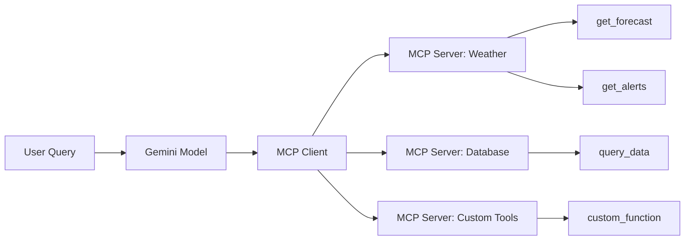

The [Model Context Protocol (MCP)](https://modelcontextprotocol.io/introduction) is an open standard that streamlines the integration of AI assistants with external data sources, tools, and systems. MCP provides a standardized interface for AI models to connect with diverse external systems and services.

## Overview

MCP enables Gemini to interact with external tools and data through a client-server architecture:

<CardGroup cols={2}>
  <Card title="MCP Servers" icon="server">
    Expose tools and resources that AI models can use
  </Card>
  <Card title="MCP Clients" icon="plug">
    Connect Gemini to one or more MCP servers
  </Card>
  <Card title="Tool Discovery" icon="magnifying-glass">
    Automatically discover available tools from servers
  </Card>
  <Card title="Function Calling" icon="phone">
    Execute tools through Gemini's function calling
  </Card>
</CardGroup>

## Why Use MCP?

- **Standardized integration**: Use the same protocol across different tools and services
- **Reusable servers**: Share MCP servers across different AI applications
- **Community ecosystem**: Leverage pre-built MCP servers or build custom ones
- **Separation of concerns**: Keep tool implementation separate from AI logic

## MCP Architecture



## Quick Start

<Steps>
  <Step title="Install Dependencies">
    Install the required packages:
    
    ```bash
    pip install --upgrade google-genai mcp geopy
    ```
  </Step>
  
  <Step title="Initialize Gemini Client">
    Set up your Google Cloud project:
    
    ```python
    from google import genai
    from google.genai import types
    
    PROJECT_ID = "your-project-id"
    LOCATION = "us-central1"
    MODEL_ID = "gemini-2.0-flash-001"
    
    client = genai.Client(vertexai=True, project=PROJECT_ID, location=LOCATION)
    ```
  </Step>
  
  <Step title="Create or Connect to MCP Server">
    Either build a custom server or use an existing one (shown in next sections)
  </Step>
</Steps>

## Building an MCP Server

Create a custom MCP server to expose your tools to Gemini:

<Tabs>
  <Tab title="Weather Server">
    Here's a complete weather server example:
    
    ```python server/weather_server.py
    import json
    import httpx
    from mcp.server.fastmcp import FastMCP
    from geopy.geocoders import Nominatim
    
    # Initialize FastMCP server
    mcp = FastMCP("weather")
    
    # Configuration
    BASE_URL = "https://api.weather.gov"
    USER_AGENT = "weather-agent"
    
    http_client = httpx.AsyncClient(
        base_url=BASE_URL,
        headers={"User-Agent": USER_AGENT, "Accept": "application/geo+json"},
        timeout=20.0
    )
    
    geolocator = Nominatim(user_agent=USER_AGENT)
    
    # Helper function
    async def get_weather_response(endpoint: str):
        try:
            response = await http_client.get(endpoint)
            response.raise_for_status()
            return response.json()
        except Exception:
            return None
    
    # Tool: Get weather alerts
    @mcp.tool()
    async def get_alerts(state: str) -> str:
        """
        Get active weather alerts for a specific US state.
        
        Args:
            state: Two-letter US state code (e.g., CA, NY, TX)
        """
        if not isinstance(state, str) or len(state) != 2:
            return "Invalid state code. Provide two-letter code (e.g., CA)."
        
        state_code = state.upper()
        endpoint = f"/alerts/active/area/{state_code}"
        data = await get_weather_response(endpoint)
        
        if not data or not data.get("features"):
            return f"No active weather alerts found for {state_code}."
        
        alerts = []
        for feature in data["features"]:
            props = feature.get("properties", {})
            alert = f"""
            Event: {props.get('event', 'N/A')}
            Area: {props.get('areaDesc', 'N/A')}
            Severity: {props.get('severity', 'N/A')}
            Headline: {props.get('headline', 'N/A')}
            """
            alerts.append(alert.strip())
        
        return "\n---\n".join(alerts)
    
    # Tool: Get forecast by coordinates
    @mcp.tool()
    async def get_forecast(latitude: float, longitude: float) -> str:
        """
        Get weather forecast for a location.
        
        Args:
            latitude: Latitude (-90 to 90)
            longitude: Longitude (-180 to 180)
        """
        if not (-90 <= latitude <= 90 and -180 <= longitude <= 180):
            return "Invalid coordinates."
        
        # Get NWS gridpoint
        point_endpoint = f"/points/{latitude:.4f},{longitude:.4f}"
        points_data = await get_weather_response(point_endpoint)
        
        if not points_data:
            return "Unable to retrieve gridpoint information."
        
        forecast_url = points_data["properties"].get("forecast")
        if not forecast_url:
            return "Could not find forecast endpoint."
        
        # Get forecast
        response = await http_client.get(forecast_url)
        forecast_data = response.json()
        
        periods = forecast_data["properties"].get("periods", [])
        if not periods:
            return "No forecast periods found."
        
        forecasts = []
        for period in periods[:5]:  # First 5 periods
            forecast = f"""
            {period.get('name', 'N/A')}
            Temperature: {period.get('temperature', 'N/A')}°{period.get('temperatureUnit', 'F')}
            Wind: {period.get('windSpeed', 'N/A')} {period.get('windDirection', 'N/A')}
            {period.get('detailedForecast', 'N/A')}
            """
            forecasts.append(forecast.strip())
        
        return "\n---\n".join(forecasts)
    
    # Tool: Get forecast by city name
    @mcp.tool()
    async def get_forecast_by_city(city: str, state: str) -> str:
        """
        Get weather forecast for a US city.
        
        Args:
            city: City name (e.g., "Los Angeles")
            state: Two-letter state code (e.g., CA)
        """
        if not city or not isinstance(city, str):
            return "Invalid city name."
        if len(state) != 2:
            return "Invalid state code."
        
        # Geocode the city
        query = f"{city.strip()}, {state.strip().upper()}, USA"
        try:
            location = geolocator.geocode(query, timeout=10)
        except Exception:
            return f"Could not find coordinates for {city}, {state}."
        
        if not location:
            return f"Location not found: {city}, {state}"
        
        # Use the forecast function
        return await get_forecast(location.latitude, location.longitude)
    
    # Run the server
    if __name__ == "__main__":
        mcp.run(transport="stdio")
    ```
  </Tab>
  
  <Tab title="Database Server">
    Create an MCP server for database queries:
    
    ```python server/database_server.py
    from mcp.server.fastmcp import FastMCP
    import sqlite3
    
    mcp = FastMCP("database")
    
    # Initialize database connection
    conn = sqlite3.connect('app.db')
    
    @mcp.tool()
    async def query_users(filter_active: bool = True) -> str:
        """
        Query users from database.
        
        Args:
            filter_active: Only return active users
        """
        cursor = conn.cursor()
        
        if filter_active:
            cursor.execute("SELECT * FROM users WHERE active = 1")
        else:
            cursor.execute("SELECT * FROM users")
        
        results = cursor.fetchall()
        return json.dumps(results)
    
    @mcp.tool()
    async def get_user_by_id(user_id: int) -> str:
        """
        Get a specific user by ID.
        
        Args:
            user_id: The user ID to look up
        """
        cursor = conn.cursor()
        cursor.execute("SELECT * FROM users WHERE id = ?", (user_id,))
        result = cursor.fetchone()
        
        if not result:
            return f"User {user_id} not found"
        
        return json.dumps(result)
    
    if __name__ == "__main__":
        mcp.run(transport="stdio")
    ```
  </Tab>
  
  <Tab title="API Integration">
    Wrap external APIs as MCP tools:
    
    ```python server/api_server.py
    from mcp.server.fastmcp import FastMCP
    import httpx
    
    mcp = FastMCP("external-api")
    
    @mcp.tool()
    async def search_products(query: str, max_results: int = 10) -> str:
        """
        Search products in the catalog.
        
        Args:
            query: Search query
            max_results: Maximum number of results
        """
        async with httpx.AsyncClient() as client:
            response = await client.get(
                "https://api.example.com/products/search",
                params={"q": query, "limit": max_results}
            )
            return response.text
    
    @mcp.tool()
    async def get_product_details(product_id: str) -> str:
        """
        Get detailed information about a product.
        
        Args:
            product_id: The product ID
        """
        async with httpx.AsyncClient() as client:
            response = await client.get(
                f"https://api.example.com/products/{product_id}"
            )
            return response.text
    
    if __name__ == "__main__":
        mcp.run(transport="stdio")
    ```
  </Tab>
</Tabs>

## Connecting Gemini to MCP Servers

Use MCP servers with Gemini through the client integration:

```python
import asyncio
from typing import Any
from mcp import ClientSession, StdioServerParameters
from mcp.client.stdio import stdio_client
from google import genai
from google.genai import types

# Configuration
PROJECT_ID = "your-project-id"
LOCATION = "us-central1"
MODEL_ID = "gemini-2.0-flash-001"

client = genai.Client(vertexai=True, project=PROJECT_ID, location=LOCATION)

# Agent loop with MCP integration
async def gemini_agent_with_mcp(user_query: str, session: ClientSession):
    """
    Run a multi-turn conversation with Gemini using MCP tools.
    
    Args:
        user_query: The user's question
        session: Active MCP client session
    """
    # Get available tools from MCP server
    tools_list = await session.list_tools()
    
    # Convert MCP tools to Gemini function declarations
    function_declarations = []
    for tool in tools_list.tools:
        func_decl = {
            "name": tool.name,
            "description": tool.description or "",
            "parameters": tool.inputSchema
        }
        function_declarations.append(func_decl)
    
    # Prepare tools for Gemini
    tools = [types.Tool(function_declarations=function_declarations)]
    
    # Initialize conversation
    messages = [
        types.Content(
            role="user",
            parts=[types.Part.from_text(user_query)]
        )
    ]
    
    # Multi-turn loop
    max_turns = 5
    for turn in range(max_turns):
        # Call Gemini
        response = client.models.generate_content(
            model=MODEL_ID,
            contents=messages,
            config=types.GenerateContentConfig(
                tools=tools,
                temperature=0.0 if turn == 0 else 1.0
            )
        )
        
        # Check if model wants to call tools
        if response.candidates[0].content.parts[0].function_call:
            function_calls = [
                part.function_call 
                for part in response.candidates[0].content.parts 
                if part.function_call
            ]
            
            # Execute tool calls via MCP
            tool_responses = await execute_tool_calls(function_calls, session)
            
            # Add to conversation history
            messages.append(response.candidates[0].content)
            messages.append(
                types.Content(
                    role="user",
                    parts=tool_responses
                )
            )
        else:
            # Model provided final answer
            return response.text
    
    return "Max turns reached"

# Execute tool calls through MCP
async def execute_tool_calls(
    function_calls: list[types.FunctionCall],
    session: ClientSession
) -> list[types.Part]:
    """
    Execute function calls via MCP server.
    
    Args:
        function_calls: List of function calls from Gemini
        session: MCP client session
    
    Returns:
        List of function response parts
    """
    tool_response_parts = []
    
    for func_call in function_calls:
        tool_name = func_call.name
        args = func_call.args if isinstance(func_call.args, dict) else {}
        
        print(f"Calling tool: {tool_name} with args: {args}")
        
        try:
            # Execute via MCP
            tool_result = await session.call_tool(tool_name, args)
            
            # Extract result
            result_text = ""
            if hasattr(tool_result, "content") and tool_result.content:
                result_text = tool_result.content[0].text or ""
            
            # Build response
            if hasattr(tool_result, "isError") and tool_result.isError:
                result_payload = {"error": result_text}
            else:
                result_payload = {"result": result_text}
            
        except Exception as e:
            result_payload = {"error": str(e)}
        
        # Create function response part
        tool_response_parts.append(
            types.Part.from_function_response(
                name=tool_name,
                response=result_payload
            )
        )
    
    return tool_response_parts
```

## Using MCP Servers

Connect to your MCP server and run queries:

```python
async def main():
    # Server parameters
    server_params = StdioServerParameters(
        command="python",
        args=["server/weather_server.py"],
        env=None
    )
    
    # Connect to MCP server
    async with stdio_client(server_params) as (read, write):
        async with ClientSession(read, write) as session:
            # Initialize the session
            await session.initialize()
            
            # Run agent with user query
            result = await gemini_agent_with_mcp(
                user_query="What's the weather forecast for Los Angeles, CA?",
                session=session
            )
            
            print(f"Final Answer: {result}")

# Run the agent
await main()
```

## Complete Example

Here's a full working example:

```python
import asyncio
from mcp import ClientSession, StdioServerParameters
from mcp.client.stdio import stdio_client
from google import genai
from google.genai import types

# Initialize Gemini
PROJECT_ID = "your-project-id"
client = genai.Client(vertexai=True, project=PROJECT_ID, location="us-central1")

async def run_weather_query():
    # Connect to weather MCP server
    server_params = StdioServerParameters(
        command="python",
        args=["server/weather_server.py"]
    )
    
    async with stdio_client(server_params) as (read, write):
        async with ClientSession(read, write) as session:
            await session.initialize()
            
            # List available tools
            tools = await session.list_tools()
            print(f"Available tools: {[t.name for t in tools.tools]}")
            
            # Run query
            result = await gemini_agent_with_mcp(
                "What are the weather alerts in California and what's the "
                "forecast for San Francisco?",
                session
            )
            
            print(f"\nGemini's Answer:\n{result}")

await run_weather_query()
```

## Using Pre-Built MCP Servers

Many MCP servers are available from the community:

<CardGroup cols={2}>
  <Card title="File System" icon="folder">
    Access and manipulate local files
  </Card>
  <Card title="GitHub" icon="github">
    Interact with GitHub repositories and issues
  </Card>
  <Card title="Google Drive" icon="google-drive">
    Search and read Google Drive documents
  </Card>
  <Card title="PostgreSQL" icon="database">
    Query PostgreSQL databases
  </Card>
</CardGroup>

Install and use pre-built servers:

```bash
# Install using uvx (recommended)
uvx install mcp-server-filesystem

# Or use npm for Node.js-based servers
npm install -g @modelcontextprotocol/server-github
```

Connect to pre-built servers:

```python
# Using filesystem server
server_params = StdioServerParameters(
    command="uvx",
    args=["mcp-server-filesystem", "/path/to/allowed/directory"]
)

# Using GitHub server
server_params = StdioServerParameters(
    command="npx",
    args=["-y", "@modelcontextprotocol/server-github"],
    env={"GITHUB_TOKEN": "your-token"}
)
```

## Multi-Agent Systems with MCP

Combine multiple MCP servers for complex workflows:

```python
from google.genai.types import Tool

async def multi_agent_system(query: str):
    # Connect to multiple MCP servers
    weather_params = StdioServerParameters(
        command="python", args=["server/weather_server.py"]
    )
    db_params = StdioServerParameters(
        command="python", args=["server/database_server.py"]
    )
    
    all_tools = []
    sessions = []
    
    # Connect to each server
    async with stdio_client(weather_params) as (r1, w1), \
                stdio_client(db_params) as (r2, w2):
        
        async with ClientSession(r1, w1) as weather_session, \
                    ClientSession(r2, w2) as db_session:
            
            await weather_session.initialize()
            await db_session.initialize()
            
            # Collect all tools
            weather_tools = await weather_session.list_tools()
            db_tools = await db_session.list_tools()
            
            # Build combined tool list for Gemini
            # ... (combine and use as shown above)
```

## Best Practices

<Note>
**Server Development Tips**
- Keep tool functions focused and single-purpose
- Provide clear, detailed descriptions for each tool
- Use type hints for all parameters
- Handle errors gracefully and return meaningful messages
- Validate input parameters
</Note>

<Warning>
**Security Considerations**
- Validate all inputs in your MCP server implementations
- Use environment variables for sensitive credentials
- Limit tool capabilities to necessary operations
- Implement rate limiting for external API calls
- Never expose internal system commands directly
</Warning>

### Error Handling

```python
@mcp.tool()
async def safe_tool(param: str) -> str:
    try:
        # Validate input
        if not param or len(param) > 100:
            return "Invalid parameter length"
        
        # Perform operation
        result = await perform_operation(param)
        return result
        
    except ValueError as e:
        return f"Validation error: {str(e)}"
    except Exception as e:
        # Log error for debugging
        logger.error(f"Tool error: {e}")
        return "An error occurred. Please try again."
```

## Next Steps

<CardGroup cols={2}>
  <Card title="MCP Specification" icon="book" href="https://modelcontextprotocol.io">
    Read the full MCP protocol specification
  </Card>
  <Card title="Function Calling" icon="phone" href="/gemini/function-calling">
    Learn more about Gemini function calling
  </Card>
  <Card title="Agent Frameworks" icon="robot" href="/gemini/agents">
    Build complex agents with MCP integration
  </Card>
  <Card title="Community Servers" icon="users" href="https://github.com/modelcontextprotocol/servers">
    Browse community-built MCP servers
  </Card>
</CardGroup>
