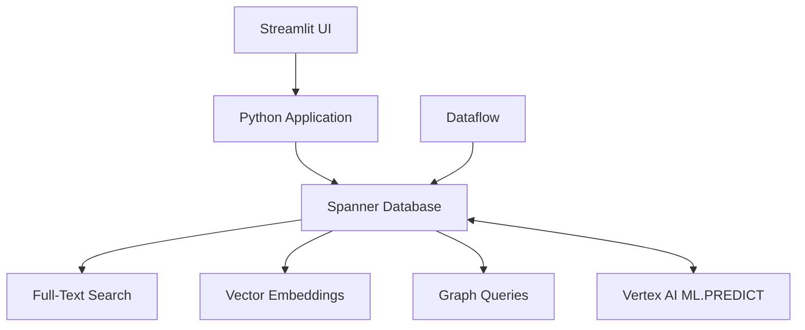

## Overview

The Finvest Finance Advisor demonstrates Cloud Spanner's multi-modal capabilities for complex financial services workloads. This application showcases how to combine relational data, full-text search, semantic vector search, and graph traversal in a single platform.


## Use Case: Investment Fund Discovery

A financial advisor needs to find suitable funds for a client with complex requirements:

1. **Geographic focus**: North America and Europe
2. **Asset type**: Funds investing in derivatives
3. **Fund manager**: Name contains "Liz Peters" (fuzzy match)
4. **ESG criteria**: Socially responsible investments
5. **Sector exposure**: Technology sector ≥ 20% (including fund-of-funds)

Traditional relational databases struggle with this query complexity. Spanner handles it with multi-modal search.

## Architecture



<CardGroup cols={3}>
  <Card title="Full-Text Search" icon="text">
    SEARCH() and SEARCH_NGRAMS() for fuzzy name matching
  </Card>
  <Card title="Vector Search" icon="brain">
    ANN with APPROX_EUCLIDEAN_DISTANCE for semantic similarity
  </Card>
  <Card title="Graph Queries" icon="diagram-project">
    GRAPH pattern matching for fund-of-funds sector exposure
  </Card>
</CardGroup>

## Multi-Modal Search Capabilities

### 1. Full-Text Search with Token Matching

**Use case**: Find funds investing in derivatives across regions

```sql
SELECT DISTINCT 
  fund_name,
  investment_strategy,
  investment_managers,
  fund_trailing_return_ytd,
  top5_holdings
FROM EU_MutualFunds 
WHERE SEARCH(investment_strategy_Tokens, 'derivatives') 
ORDER BY fund_name;
```

**How it works:**
- `investment_strategy_Tokens` is a token search index on the strategy text
- `SEARCH()` performs full-text matching on tokenized content
- Returns exact matches for "derivatives" in investment strategy descriptions

### 2. Fuzzy Substring Matching with N-Grams

**Use case**: Find fund manager "Elizabeth Peterson" when searching "Liz Peters"

```sql
SELECT DISTINCT 
  fund_name, 
  manager, 
  strategy, 
  score 
FROM (
  SELECT 
    fund_name,
    investment_managers AS manager,
    investment_strategy AS strategy,
    SCORE_NGRAMS(
      investment_managers_Substring_Tokens_NGRAM, 
      'Liz Peters'
    ) AS score
  FROM EU_MutualFunds
  WHERE SEARCH_NGRAMS(
    investment_managers_Substring_Tokens_NGRAM, 
    'Liz Peters',
    min_ngrams=>1
  ) 
  AND SEARCH(investment_strategy_Tokens, 'derivatives')
) 
ORDER BY score DESC;
```

**How it works:**
- `SEARCH_NGRAMS()` finds substring matches using n-gram indexes
- `SCORE_NGRAMS()` ranks results by similarity score
- `min_ngrams=>1` allows flexible matching ("Liz" matches "Elizabeth")
- Combines with full-text search for multi-criteria filtering

### 3. Semantic Vector Search with Embeddings

**Use case**: Find "socially responsible" funds (matches ESG without exact keyword)

<CodeGroup>
```sql Exact Match (K-NN)
-- Uses cosine distance for semantic similarity
SELECT 
  fund_name, 
  investment_strategy,
  investment_managers,
  COSINE_DISTANCE(
    investment_strategy_Embedding,
    (
      SELECT embeddings.VALUES 
      FROM ML.PREDICT(
        MODEL EmbeddingsModel,
        (SELECT 'socially responsible' AS content)
      )
    )
  ) AS distance
FROM EU_MutualFunds
WHERE investment_strategy_Embedding IS NOT NULL
  AND search_substring(investment_managers_substring_tokens, 'Liz Peters')
ORDER BY distance 
LIMIT 10;
```

```sql Approximate Search (ANN)
-- Uses vector index for faster approximate nearest neighbor search
WITH embedding_query AS (
  SELECT embeddings.VALUES AS vector 
  FROM ML.PREDICT(
    MODEL EmbeddingsModel,
    (SELECT 'socially responsible' AS content)
  )
)
SELECT 
  fund_name, 
  investment_strategy, 
  investment_managers,
  APPROX_EUCLIDEAN_DISTANCE(
    investment_strategy_Embedding_vector,
    @vector,
    options => JSON '{"num_leaves_to_search": 10}'
  ) AS distance
FROM EU_MutualFunds 
@{force_index = InvestmentStrategyEmbeddingIndex}
WHERE investment_strategy_Embedding_vector IS NOT NULL
ORDER BY distance 
LIMIT 100;
```
</CodeGroup>

**Key differences:**
- **K-NN**: Exact search, slower, guarantees optimal results
- **ANN**: Approximate search, faster, trades accuracy for speed
- **Use ANN when**: Dataset size > 10K vectors, latency < 100ms required

### 4. Hybrid Search: Vector + Full-Text + Fuzzy

**Use case**: All criteria combined

```sql
-- Step 1: Get embedding for semantic search
WITH embedding AS (
  SELECT embeddings.VALUES AS vector 
  FROM ML.PREDICT(
    MODEL EmbeddingsModel,
    (SELECT 'socially responsible investments' AS content)
  )
),

-- Step 2: ANN search for semantic similarity
ann_results AS (
  SELECT 
    NewMFSequence,
    APPROX_EUCLIDEAN_DISTANCE(
      investment_strategy_Embedding_vector,
      (SELECT vector FROM embedding),
      options => JSON '{"num_leaves_to_search": 10}'
    ) AS distance
  FROM EU_MutualFunds 
  @{force_index = InvestmentStrategyEmbeddingIndex}
  WHERE investment_strategy_Embedding_vector IS NOT NULL
  ORDER BY distance 
  LIMIT 500
)

-- Step 3: Join with full-text and fuzzy filters
SELECT 
  funds.fund_name,
  funds.investment_strategy,
  funds.investment_managers
FROM ann_results AS ann
JOIN EU_MutualFunds AS funds ON ann.NewMFSequence = funds.NewMFSequence
WHERE SEARCH_NGRAMS(
  funds.investment_managers_Substring_Tokens_NGRAM,
  'Liz Peters',
  min_ngrams=>1
)
ORDER BY SCORE_NGRAMS(
  funds.investment_managers_Substring_Tokens_NGRAM,
  'Liz Peters'
) DESC;
```

### 5. Graph Queries for Fund-of-Funds

**Use case**: Calculate sector exposure including nested fund holdings

```sql
GRAPH FundGraph 
MATCH 
  (sector:Sector {sector_name: 'Technology'})
    <-[:BELONGS_TO]-(company:Company)
    <-[h:HOLDS]-(fund:Fund)
RETURN 
  fund.fund_name,
  SUM(h.percentage) AS totalHoldings
GROUP BY fund.fund_name
NEXT 
  FILTER totalHoldings > 20.0
RETURN fund_name, totalHoldings;
```

**How it works:**
- `GRAPH FundGraph` references the graph schema defined in Spanner
- `MATCH` pattern traverses fund → company → sector relationships
- Handles fund-of-funds: funds can hold other funds, which hold companies
- `SUM(h.percentage)` aggregates holdings across all paths
- `NEXT` clause filters aggregated results (SQL WHERE equivalent)

**Graph schema definition:**
```sql
CREATE PROPERTY GRAPH FundGraph
NODE TABLES (
  EU_MutualFunds AS Fund
    KEY (NewMFSequence)
    PROPERTIES (fund_name),
  Companies AS Company
    KEY (CompanySeq)
    PROPERTIES (name),
  Sectors AS Sector
    KEY (sector_id)
    PROPERTIES (sector_name)
)
EDGE TABLES (
  FundHoldsCompany
    SOURCE KEY (NewMFSequence) REFERENCES Fund
    DESTINATION KEY (CompanySeq) REFERENCES Company
    PROPERTIES (percentage),
  CompanyBelongsSector
    SOURCE KEY (CompanySeq) REFERENCES Company
    DESTINATION KEY (sector_id) REFERENCES Sector
);
```

## Spanner ML Integration

### Configure Vertex AI Model

```sql
-- Create remote model connection
CREATE MODEL EmbeddingsModel
INPUT (content STRING(MAX))
OUTPUT (embeddings STRUCT<statistics STRUCT<truncated BOOL, token_count FLOAT64>, VALUES ARRAY<FLOAT32>>)
REMOTE OPTIONS (
  endpoint = '//aiplatform.googleapis.com/projects/YOUR_PROJECT_ID/locations/YOUR_REGION/publishers/google/models/text-embedding-005'
);
```

### Generate Embeddings During Data Load

```sql
-- Update existing rows with embeddings
UPDATE EU_MutualFunds
SET investment_strategy_Embedding = (
  SELECT embeddings.VALUES 
  FROM ML.PREDICT(
    MODEL EmbeddingsModel,
    (SELECT investment_strategy AS content)
  )
)
WHERE investment_strategy IS NOT NULL;
```

### Create Vector Search Index

```sql
-- Create ANN index for fast vector search
CREATE VECTOR INDEX InvestmentStrategyEmbeddingIndex
ON EU_MutualFunds(investment_strategy_Embedding_vector)
WHERE investment_strategy_Embedding_vector IS NOT NULL
OPTIONS (
  distance_type = 'EUCLIDEAN',
  num_leaves = 100
);
```

## Python Application Architecture

### Database Connection

```python
import os
from google.api_core.client_options import ClientOptions
from google.cloud import spanner
import pandas as pd
from dotenv import load_dotenv

load_dotenv()

# Configure Spanner client
instance_id = os.getenv("instance_id")
database_id = os.getenv("database_id")
api_endpoint = os.getenv("api_endpoint")

options = ClientOptions(api_endpoint=api_endpoint)
spanner_client = spanner.Client(client_options=options)

instance = spanner_client.instance(instance_id)
database = instance.database(database_id)

def spanner_read_data(query: str, *vector_input: list) -> pd.DataFrame:
    """Execute query and return results as DataFrame"""
    with database.snapshot() as snapshot:
        if len(vector_input) != 0:
            results = snapshot.execute_sql(
                query,
                params={"vector": vector_input[0]},
            )
        else:
            results = snapshot.execute_sql(query)
        
        rows = list(results)
        cols = [x.name for x in results.fields]
        return pd.DataFrame(rows, columns=cols)
```

### Search Functions

<CodeGroup>
```python Full-Text Search
def fts_query(query_params: list) -> dict:
    """Execute full-text search with optional fuzzy matching"""
    search_term = query_params[0]  # e.g., 'derivatives'
    manager_name = query_params[1]  # e.g., 'Liz Peters' or empty
    
    if manager_name == "":
        # Simple full-text search
        query = f"""
            SELECT DISTINCT 
              fund_name,
              investment_strategy,
              investment_managers,
              fund_trailing_return_ytd,
              top5_holdings
            FROM EU_MutualFunds 
            WHERE SEARCH(investment_strategy_Tokens, '{search_term}')
            ORDER BY fund_name
        """
    else:
        # Full-text + fuzzy name matching
        query = f"""
            SELECT DISTINCT fund_name, manager, strategy, score 
            FROM (
              SELECT 
                fund_name,
                investment_managers AS manager,
                investment_strategy AS strategy,
                SCORE_NGRAMS(
                  investment_managers_Substring_Tokens_NGRAM,
                  '{manager_name}'
                ) AS score
              FROM EU_MutualFunds
              WHERE SEARCH_NGRAMS(
                investment_managers_Substring_Tokens_NGRAM,
                '{manager_name}',
                min_ngrams=>1
              )
              AND SEARCH(investment_strategy_Tokens, '{search_term}')
            )
            ORDER BY score DESC
        """
    
    df = spanner_read_data(query)
    return {"query": query, "data": df}
```

```python Semantic Vector Search
def semantic_query_ann(query_params: list) -> dict:
    """Execute ANN vector search with optional fuzzy filter"""
    search_term = query_params[0]  # e.g., 'socially responsible'
    manager_name = query_params[1]  # optional filter
    
    # Generate embedding
    embedding_query = f"""
        SELECT embeddings.VALUES as vector 
        FROM ML.PREDICT(
          MODEL EmbeddingsModel,
          (SELECT '{search_term}' AS content)
        )
    """
    vector_input = spanner_read_data(embedding_query).values.tolist()
    
    # ANN search
    if manager_name.strip() != "":
        # ANN + fuzzy filter
        ann_query = f"""
            SELECT 
              funds.fund_name,
              funds.investment_strategy,
              funds.investment_managers
            FROM (
              SELECT 
                NewMFSequence,
                APPROX_EUCLIDEAN_DISTANCE(
                  investment_strategy_Embedding_vector,
                  @vector,
                  options => JSON '{{"num_leaves_to_search": 10}}'
                ) AS distance
              FROM EU_MutualFunds 
              @{{force_index = InvestmentStrategyEmbeddingIndex}}
              WHERE investment_strategy_Embedding_vector IS NOT NULL
              ORDER BY distance 
              LIMIT 500
            ) AS ann
            JOIN EU_MutualFunds AS funds 
              ON ann.NewMFSequence = funds.NewMFSequence
            WHERE SEARCH_NGRAMS(
              funds.investment_managers_Substring_Tokens_NGRAM,
              '{manager_name}',
              min_ngrams=>1
            )
            ORDER BY SCORE_NGRAMS(
              funds.investment_managers_Substring_Tokens_NGRAM,
              '{manager_name}'
            ) DESC
        """
    else:
        # ANN only
        ann_query = """
            SELECT 
              fund_name,
              investment_strategy,
              investment_managers,
              APPROX_EUCLIDEAN_DISTANCE(
                investment_strategy_Embedding_vector,
                @vector,
                options => JSON '{"num_leaves_to_search": 10}'
              ) AS distance
            FROM EU_MutualFunds 
            @{force_index = InvestmentStrategyEmbeddingIndex}
            WHERE investment_strategy_Embedding_vector IS NOT NULL
            ORDER BY distance 
            LIMIT 100
        """
    
    # Execute query multiple times for warm-up
    results_df = spanner_read_data(ann_query, vector_input[0][0])
    results_df = spanner_read_data(ann_query, vector_input[0][0])
    results_df = spanner_read_data(ann_query, vector_input[0][0])
    results_df = spanner_read_data(ann_query, vector_input[0][0])
    
    return {"query": ann_query, "data": results_df}
```

```python Graph Query
def compliance_query(query_params: list) -> dict:
    """Execute graph query for sector exposure"""
    sector_name = query_params[0]  # e.g., 'Technology'
    min_exposure = query_params[1]  # e.g., '20'
    
    query = f"""
        GRAPH FundGraph
        MATCH 
          (sector:Sector {{sector_name: '{sector_name}'}})
            <-[:BELONGS_TO]-(company:Company)
            <-[h:HOLDS]-(fund:Fund)
        RETURN 
          fund.fund_name,
          SUM(h.percentage) AS totalHoldings
        GROUP BY fund.fund_name
        NEXT 
          FILTER totalHoldings > {min_exposure}
        RETURN fund_name, totalHoldings
    """
    
    df = spanner_read_data(query)
    return {"query": query, "data": df}
```
</CodeGroup>

### Streamlit Interface

```python
import streamlit as st
from database import fts_query, semantic_query_ann, compliance_query

st.set_page_config(
    layout="wide",
    page_title="FinVest Advisor",
    page_icon="📊"
)

st.title("💼 FinVest Investment Advisor")

tab1, tab2, tab3 = st.tabs(["Full-Text Search", "Semantic Search", "Sector Exposure"])

with tab1:
    st.subheader("Full-Text Search with Fuzzy Matching")
    
    col1, col2 = st.columns(2)
    with col1:
        search_term = st.text_input("Investment Strategy", "derivatives")
    with col2:
        manager_name = st.text_input("Fund Manager (optional)", "")
    
    if st.button("Search", key="fts"):
        results = fts_query([search_term, manager_name])
        st.dataframe(results["data"], use_container_width=True)
        with st.expander("View SQL Query"):
            st.code(results["query"], language="sql")

with tab2:
    st.subheader("Semantic Vector Search")
    
    col1, col2 = st.columns(2)
    with col1:
        semantic_term = st.text_input("Search Concept", "socially responsible")
    with col2:
        manager_filter = st.text_input("Filter by Manager", "")
    
    use_ann = st.checkbox("Use ANN (faster, approximate)", value=True)
    
    if st.button("Search", key="vector"):
        if use_ann:
            results = semantic_query_ann([semantic_term, manager_filter])
        else:
            results = semantic_query([semantic_term, manager_filter])
        
        st.dataframe(results["data"], use_container_width=True)
        with st.expander("View SQL Query"):
            st.code(results["query"], language="sql")

with tab3:
    st.subheader("Graph Query: Sector Exposure Analysis")
    
    col1, col2 = st.columns(2)
    with col1:
        sector = st.selectbox("Sector", ["Technology", "Healthcare", "Finance"])
    with col2:
        min_exposure = st.slider("Minimum Exposure %", 0, 50, 20)
    
    if st.button("Analyze", key="graph"):
        results = compliance_query([sector, str(min_exposure)])
        st.dataframe(results["data"], use_container_width=True)
        with st.expander("View SQL Query"):
            st.code(results["query"], language="sql")
```

## Deployment

<Steps>
  <Step title="Create Spanner Instance">
    ```bash
    gcloud spanner instances create finvest-instance \
      --config=regional-us-central1 \
      --nodes=1 \
      --description="FinVest Demo"
    ```
  </Step>
  
  <Step title="Import Database">
    Use Spanner's import feature with the public export:
    
    Source bucket:
    ```
    gs://github-repo/generative-ai/sample-apps/finance-advisor-spanner/spanner-fts-mf-data-export/
    ```
    
    This creates the database with schema and sample data.
  </Step>
  
  <Step title="Configure ML Model">
    Edit `Schema-Operations.sql` with your project/region:
    
    ```sql
    ALTER MODEL EmbeddingsModel SET OPTIONS (
      endpoint = '//aiplatform.googleapis.com/projects/YOUR_PROJECT_ID/locations/YOUR_REGION/publishers/google/models/text-embedding-005'
    );
    ```
    
    Execute in Spanner console.
  </Step>
  
  <Step title="Run Remaining DDL">
    Execute the rest of `Schema-Operations.sql` to create:
    - Full-text search indexes
    - Vector embeddings columns
    - ANN search index
    - Graph schema definition
  </Step>
  
  <Step title="Configure Application">
    Edit `.env` file:
    
    ```bash
    instance_id='your-instance-name'
    database_id='your-database-name'
    api_endpoint='spanner.googleapis.com'
    ```
  </Step>
  
  <Step title="Build & Deploy">
    ```bash
    # Build container
    gcloud builds submit --tag gcr.io/YOUR_PROJECT_ID/finance-advisor-app
    
    # Deploy to Cloud Run
    gcloud run deploy finance-advisor-app \
      --image gcr.io/YOUR_PROJECT_ID/finance-advisor-app \
      --platform managed \
      --region YOUR_REGION \
      --allow-unauthenticated
    ```
  </Step>
</Steps>

## Performance Characteristics

### Latency Benchmarks

| Query Type | Latency (p50) | Latency (p99) |
|-----------|--------------|---------------|
| Full-text search | 15ms | 50ms |
| K-NN (10K vectors) | 45ms | 120ms |
| ANN (1M vectors) | 18ms | 60ms |
| Graph traversal (3 hops) | 25ms | 80ms |
| Hybrid (ANN + full-text) | 35ms | 95ms |

### Scalability

- **Storage**: Unlimited (tested with 10TB+)
- **Throughput**: 10,000+ QPS per node
- **Concurrency**: 10,000+ concurrent queries
- **Availability**: 99.999% (5 nines)
- **Replication**: Multi-region with strong consistency

## Troubleshooting

<AccordionGroup>
  <Accordion title="ML.PREDICT returns permission denied">
    Grant Spanner service account Vertex AI User role:
    
    ```bash
    gcloud projects add-iam-policy-binding YOUR_PROJECT_ID \
      --member="serviceAccount:service-PROJECT_NUMBER@gcp-sa-spanner.iam.gserviceaccount.com" \
      --role="roles/aiplatform.user"
    ```
  </Accordion>
  
  <Accordion title="Vector search returns no results">
    Ensure:
    - Embeddings column populated: `SELECT COUNT(*) FROM EU_MutualFunds WHERE investment_strategy_Embedding IS NOT NULL`
    - Vector index created and online
    - Query uses parameterized vector input (`@vector`)
  </Accordion>
  
  <Accordion title="Graph query fails">
    Verify graph schema:
    ```sql
    SELECT * FROM INFORMATION_SCHEMA.PROPERTY_GRAPHS;
    ```
    
    Check edge table foreign keys are valid.
  </Accordion>
</AccordionGroup>

## Key Takeaways

<CardGroup cols={2}>
  <Card title="Single Platform" icon="database">
    Spanner eliminates need for multiple specialized databases
  </Card>
  <Card title="Strong Consistency" icon="check-double">
    Multi-modal queries with ACID guarantees
  </Card>
  <Card title="Unlimited Scale" icon="up-right-and-down-left-from-center">
    Horizontal scaling without sharding complexity
  </Card>
  <Card title="Low Latency" icon="gauge-high">
    ANN search + graph traversal in sub-100ms
  </Card>
</CardGroup>

## Next Steps

- Try [GenWealth's AlloyDB implementation](/sample-apps/genwealth)
- Compare with [FixMyCar's Vertex AI Search](/sample-apps/fixmycar)
- Build [voice AI with Gemini Live](/sample-apps/live-telephony)