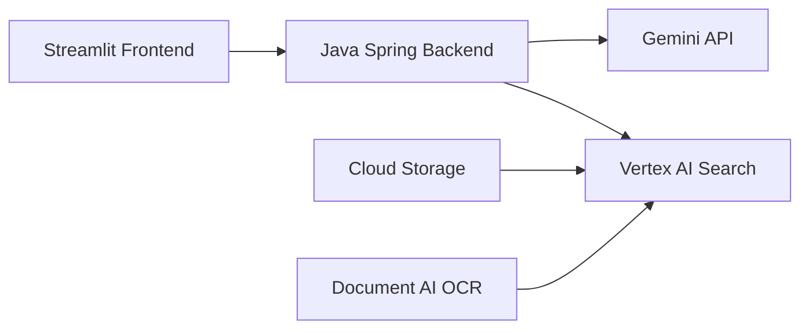

## Overview

FixMyCar is a production-ready Retrieval-Augmented Generation (RAG) application that helps car owners troubleshoot issues by querying vehicle owner's manuals. The application demonstrates how to integrate Vertex AI Search with Gemini for accurate, grounded responses.


## Architecture

### System Components



<CardGroup cols={2}>
  <Card title="Frontend" icon="browser">
    **Streamlit Python App**
    - Chat interface
    - Real-time streaming
    - Deployed on GKE
  </Card>
  <Card title="Backend" icon="server">
    **Java Spring Boot**
    - REST API
    - Vertex AI Search client
    - Gemini integration
  </Card>
  <Card title="Search Engine" icon="magnifying-glass">
    **Vertex AI Search**
    - OCR Parser for PDFs
    - Vector embeddings
    - Extractive answers
  </Card>
  <Card title="Infrastructure" icon="cube">
    **GKE Autopilot**
    - Auto-scaling
    - Workload Identity
    - Load balancing
  </Card>
</CardGroup>

## RAG Implementation

### Two-Step RAG Pipeline

FixMyCar implements the classic RAG pattern:

<Steps>
  <Step title="Retrieval: Vertex AI Search">
    Search the car manual datastore using natural language query
  </Step>
  <Step title="Augmentation: Prompt Engineering">
    Construct Gemini prompt with search results as grounding context
  </Step>
  <Step title="Generation: Gemini Inference">
    Generate accurate, contextual response based on manual excerpts
  </Step>
</Steps>

### Java Backend Implementation

<CodeGroup>
```java RAG Controller
package com.cpet.fixmycarbackend;

import com.google.cloud.discoveryengine.v1.*;
import com.google.cloud.vertexai.VertexAI;
import com.google.cloud.vertexai.generativeai.ChatSession;
import com.google.cloud.vertexai.generativeai.GenerativeModel;

@RestController
public class FixMyCarBackendController {
  @Autowired
  private FixMyCarConfiguration config;
  
  @PostMapping("/chat")
  public ChatMessage message(@RequestBody ChatMessage message) {
    return ragVertexAISearch(message);
  }
  
  public ChatMessage ragVertexAISearch(ChatMessage message) {
    // Step 1: Search Vertex AI Search datastore
    String searchQuery = message.getPrompt();
    String vectorSearchResults = performVertexAISearch(searchQuery);
    
    // Step 2: Generate response with Gemini
    String result = geminiInference(
      message.getPrompt(), 
      vectorSearchResults
    );
    message.setResponse(result);
    return message;
  }
}
```

```java Vertex AI Search Client
private String performVertexAISearch(String query) {
  String location = "global";
  String collectionId = "default_collection";
  String servingConfigId = "default_search";
  
  SearchServiceClient searchServiceClient = SearchServiceClient.create(
    SearchServiceSettings.newBuilder()
      .setEndpoint("discoveryengine.googleapis.com:443")
      .build()
  );
  
  SearchRequest request = SearchRequest.newBuilder()
    .setServingConfig(ServingConfigName.format(
      projectId, location, collectionId, datastoreId, servingConfigId
    ))
    .setQuery(query)
    .setPageSize(10)
    .build();
  
  SearchResponse response = searchServiceClient
    .search(request)
    .getPage()
    .getResponse();
  
  // Parse extractive answers from proto response
  StringBuilder results = new StringBuilder();
  for (SearchResult result : response.getResultsList()) {
    Struct structData = result.getDocument().getDerivedStructData();
    Value extractiveAnswers = structData.getFieldsMap()
      .get("extractive_answers");
    
    ListValue listValue = extractiveAnswers.getListValue();
    for (Value value : listValue.getValuesList()) {
      Struct answerStruct = value.getStructValue();
      String content = answerStruct.getFieldsMap()
        .get("content")
        .getStringValue();
      results.append(content).append(" ");
    }
  }
  
  logger.info("🔍 Found " + response.getResultsCount() + " results");
  logger.info("🔍 Vertex AI Search results: " + results.toString());
  return results.toString();
}
```

```java Gemini Inference
public String geminiInference(String userPrompt, String groundingData) {
  String augmentedPrompt = String.format(
    """You are a helpful car manual chatbot. 
    Answer the car owner's question about their car.
    
    Human prompt: %s
    
    Use the following grounding data as context. 
    This came from the relevant vehicle owner's manual:
    %s""",
    userPrompt,
    groundingData
  );
  
  logger.info("🔮 Gemini Prompt: " + augmentedPrompt);
  
  String geminiLocation = "us-central1";
  String modelName = "gemini-2.0-flash";
  
  VertexAI vertexAI = new VertexAI(projectId, geminiLocation);
  GenerativeModel model = new GenerativeModel(modelName, vertexAI);
  ChatSession chatSession = new ChatSession(model);
  
  GenerateContentResponse response = chatSession.sendMessage(augmentedPrompt);
  String textResponse = ResponseHandler.getText(response);
  
  logger.info("🔮 Gemini Response: " + textResponse);
  return textResponse;
}
```
</CodeGroup>

### Streamlit Frontend

```python
import streamlit as st
import requests

BACKEND_URL = "http://fixmycar-backend:8080/chat"

st.title("🚗 FixMyCar Assistant")
st.write("Ask questions about your Cymbal Starlight 2024")

# Chat interface
if prompt := st.chat_input("What's your question?"):
    st.chat_message("user").write(prompt)
    
    # Call backend API
    response = requests.post(
        BACKEND_URL,
        json={"prompt": prompt},
        headers={"Content-Type": "application/json"}
    )
    
    if response.status_code == 200:
        data = response.json()
        st.chat_message("assistant").write(data["response"])
    else:
        st.error("Failed to get response from backend")
```

## Vertex AI Search Configuration

### OCR Parser for PDFs

Vertex AI Search uses Document AI's OCR parser to extract text from owner's manuals:

<Steps>
  <Step title="Upload PDFs to Cloud Storage">
    Store manuals in GCS bucket (e.g., `cymbal-starlight-2024.pdf`)
  </Step>
  <Step title="Create Datastore">
    Configure with:
    - **Source**: Cloud Storage bucket
    - **Parser**: OCR Parser (not Layout Parser)
    - **Region**: Global
    - **Enterprise features**: Enabled
  </Step>
  <Step title="Indexing">
    Vertex AI Search automatically:
    - Extracts text from PDFs
    - Generates vector embeddings
    - Creates extractive answer indexes
    - Builds search indexes
    
    **Duration**: ~10 minutes for typical owner's manual
  </Step>
  <Step title="Test Search">
    Use Preview interface to test queries before deployment
  </Step>
</Steps>

### Extractive Answers

Vertex AI Search returns structured extractive answers:

```json
{
  "results": [
    {
      "document": {
        "derivedStructData": {
          "extractive_answers": [
            {
              "content": "The Cymbal Starlight 2024 has a cargo capacity of 13.5 cubic feet. The cargo area is located in the trunk of the vehicle.",
              "pageNumber": 42
            }
          ]
        }
      }
    }
  ]
}
```

These answers are pre-extracted during indexing, not generated by LLM, ensuring:
- **Accuracy**: Direct quotes from source documents
- **Low latency**: No inference required during retrieval
- **Grounding**: Provenance with page numbers

## GKE Deployment

### Workload Identity Setup

FixMyCar uses GKE Workload Identity to authenticate with Vertex AI:

```bash
#!/bin/bash
# workload_identity.sh

PROJECT_ID=$(gcloud config get-value project)
CLUSTER_NAME="fixmycar"
REGION="us-central1"
NAMESPACE="default"
KSA_NAME="fixmycar-backend-sa"  # Kubernetes Service Account
GSA_NAME="fixmycar-gsa"         # Google Cloud Service Account

# Create Google Cloud Service Account
gcloud iam service-accounts create ${GSA_NAME} \
  --display-name="FixMyCar Backend Service Account"

# Grant Vertex AI permissions
gcloud projects add-iam-policy-binding ${PROJECT_ID} \
  --member="serviceAccount:${GSA_NAME}@${PROJECT_ID}.iam.gserviceaccount.com" \
  --role="roles/aiplatform.user"

gcloud projects add-iam-policy-binding ${PROJECT_ID} \
  --member="serviceAccount:${GSA_NAME}@${PROJECT_ID}.iam.gserviceaccount.com" \
  --role="roles/discoveryengine.editor"

# Create Kubernetes Service Account
kubectl create serviceaccount ${KSA_NAME} -n ${NAMESPACE}

# Bind Kubernetes SA to Google Cloud SA
gcloud iam service-accounts add-iam-policy-binding \
  ${GSA_NAME}@${PROJECT_ID}.iam.gserviceaccount.com \
  --role="roles/iam.workloadIdentityUser" \
  --member="serviceAccount:${PROJECT_ID}.svc.id.goog[${NAMESPACE}/${KSA_NAME}]"

# Annotate Kubernetes SA
kubectl annotate serviceaccount ${KSA_NAME} \
  -n ${NAMESPACE} \
  iam.gke.io/gcp-service-account=${GSA_NAME}@${PROJECT_ID}.iam.gserviceaccount.com
```

### Kubernetes Manifests

<CodeGroup>
```yaml Backend Deployment
apiVersion: apps/v1
kind: Deployment
metadata:
  name: fixmycar-backend
spec:
  replicas: 2
  selector:
    matchLabels:
      app: fixmycar-backend
  template:
    metadata:
      labels:
        app: fixmycar-backend
    spec:
      serviceAccountName: fixmycar-backend-sa
      containers:
      - name: fixmycar-backend
        image: us-central1-docker.pkg.dev/PROJECT_ID/fixmycar/backend:latest
        ports:
        - containerPort: 8080
        env:
        - name: GCP_PROJECT_ID
          value: "your-project-id"
        - name: VERTEX_AI_DATASTORE_ID
          value: "your-datastore-id"
        resources:
          requests:
            memory: "512Mi"
            cpu: "500m"
          limits:
            memory: "1Gi"
            cpu: "1000m"
```

```yaml Backend Service
apiVersion: v1
kind: Service
metadata:
  name: fixmycar-backend
spec:
  type: ClusterIP
  selector:
    app: fixmycar-backend
  ports:
  - port: 8080
    targetPort: 8080
```

```yaml Frontend Deployment
apiVersion: apps/v1
kind: Deployment
metadata:
  name: fixmycar-frontend
spec:
  replicas: 1
  selector:
    matchLabels:
      app: fixmycar-frontend
  template:
    metadata:
      labels:
        app: fixmycar-frontend
    spec:
      containers:
      - name: fixmycar-frontend
        image: us-central1-docker.pkg.dev/PROJECT_ID/fixmycar/frontend:latest
        ports:
        - containerPort: 8501
        env:
        - name: BACKEND_URL
          value: "http://fixmycar-backend:8080"
        resources:
          requests:
            memory: "256Mi"
            cpu: "250m"
```

```yaml Frontend Service
apiVersion: v1
kind: Service
metadata:
  name: fixmycar-frontend
spec:
  type: LoadBalancer
  selector:
    app: fixmycar-frontend
  ports:
  - port: 80
    targetPort: 8501
```
</CodeGroup>

## Deployment Steps

<Steps>
  <Step title="Prerequisites">
    - Google Cloud project with billing
    - gcloud CLI installed
    - Docker or Colima for container builds
    - Java 18+, Maven 3.9.6+
    - Python 3.9+
  </Step>
  
  <Step title="Create Artifact Registry">
    ```bash
    gcloud artifacts repositories create fixmycar \
      --repository-format=docker \
      --location=us-central1
    ```
  </Step>
  
  <Step title="Build & Push Containers">
    ```bash
    # Authenticate Docker
    gcloud auth configure-docker us-central1-docker.pkg.dev
    
    # Update PROJECT_ID in dockerpush.sh
    ./dockerpush.sh
    ```
  </Step>
  
  <Step title="Create GKE Cluster">
    ```bash
    gcloud container clusters create-auto fixmycar \
      --region=us-central1 \
      --project=YOUR_PROJECT_ID
    
    # Get credentials
    gcloud container clusters get-credentials fixmycar \
      --region=us-central1
    ```
  </Step>
  
  <Step title="Upload Owner's Manual">
    ```bash
    # Create bucket
    gcloud storage buckets create gs://YOUR_PROJECT_ID-fixmycar \
      --location=us-central1
    
    # Upload manual
    gcloud storage cp cymbal-starlight-2024.pdf \
      gs://YOUR_PROJECT_ID-fixmycar/
    ```
  </Step>
  
  <Step title="Configure Vertex AI Search">
    1. Navigate to Agent Builder in console
    2. Create Search app: `YOUR_PROJECT_ID-fixmycar`
    3. Create datastore:
       - Source: Cloud Storage bucket
       - Parser: OCR Parser
       - Region: Global
    4. Wait ~10 minutes for indexing
    5. Test in Preview interface
  </Step>
  
  <Step title="Setup Workload Identity">
    ```bash
    ./workload_identity.sh
    ```
  </Step>
  
  <Step title="Deploy to GKE">
    ```bash
    # Update image and env vars in YAML files
    kubectl apply -f kubernetes/backend-deployment-vertex-search.yaml
    kubectl apply -f kubernetes/backend-service.yaml
    kubectl apply -f kubernetes/frontend-deployment.yaml
    kubectl apply -f kubernetes/frontend-service.yaml
    
    # Wait for pods to be ready
    kubectl get pods -w
    ```
  </Step>
  
  <Step title="Access Application">
    ```bash
    # Get external IP
    kubectl get service fixmycar-frontend
    
    # Open in browser: http://EXTERNAL_IP
    ```
  </Step>
</Steps>

## Testing & Validation

### Example Queries

<CodeGroup>
```bash Cargo Capacity
Cymbal Starlight 2024: What is the max cargo capacity?

# Expected Response:
# The Cymbal Starlight 2024 has a cargo capacity of 13.5 cubic feet. 
# The cargo area is located in the trunk of the vehicle.
```

```bash Towing Capability
Can I tow a trailer with the Cymbal Starlight 2024?

# Expected Response:
# No, the Cymbal Starlight 2024 is not equipped to tow a trailer.
```

```bash Maintenance Schedule
When should I change the oil in my Cymbal Starlight 2024?

# Expected Response:
# [Answer from manual's maintenance section]
```
</CodeGroup>

### Backend Logs

View RAG pipeline execution:

```bash
kubectl logs -l app=fixmycar-backend --tail=100 -f
```

**Example output:**
```
2024-03-23T23:35:07.059Z INFO --- 🔍 Vertex AI Search results: 
Chapter 6: Towing, Cargo, and Luggage
The Cymbal Starlight 2024 has a cargo capacity of 13.5 cubic feet.

2024-03-23T23:35:07.060Z INFO --- 🔮 Gemini Prompt: 
You are a helpful car manual chatbot...
Human prompt: What is the max cargo capacity?
Grounding data: [The Cymbal Starlight 2024 has a cargo capacity...]

2024-03-23T23:35:07.762Z INFO --- 🔮 Gemini Response: 
The Cymbal Starlight 2024 has a cargo capacity of 13.5 cubic feet.
```

## Performance Optimization

### Caching Strategy

```java
@Configuration
public class CacheConfig {
  @Bean
  public CacheManager cacheManager() {
    return new ConcurrentMapCacheManager("searchResults");
  }
}

@Service
public class SearchService {
  @Cacheable(value = "searchResults", key = "#query")
  public String search(String query) {
    return performVertexAISearch(query);
  }
}
```

### GKE Autoscaling

```yaml
apiVersion: autoscaling/v2
kind: HorizontalPodAutoscaler
metadata:
  name: fixmycar-backend-hpa
spec:
  scaleTargetRef:
    apiVersion: apps/v1
    kind: Deployment
    name: fixmycar-backend
  minReplicas: 2
  maxReplicas: 10
  metrics:
  - type: Resource
    resource:
      name: cpu
      target:
        type: Utilization
        averageUtilization: 70
```

## Troubleshooting

<AccordionGroup>
  <Accordion title="Pods stuck in Pending state">
    GKE Autopilot is scaling up nodes. Wait 3-5 minutes.
    
    ```bash
    kubectl describe pod <pod-name>
    ```
  </Accordion>
  
  <Accordion title="403 Forbidden from Vertex AI">
    Check Workload Identity configuration:
    
    ```bash
    # Verify annotation
    kubectl get sa fixmycar-backend-sa -o yaml
    
    # Verify IAM binding
    gcloud iam service-accounts get-iam-policy \
      fixmycar-gsa@PROJECT_ID.iam.gserviceaccount.com
    ```
  </Accordion>
  
  <Accordion title="Vertex AI Search returns no results">
    Ensure:
    - Datastore indexing completed (check Activity tab)
    - OCR Parser selected (not Layout Parser)
    - PDFs uploaded to correct bucket path
    - Test query in Preview interface first
  </Accordion>
  
  <Accordion title="Backend returns 500 error">
    Check logs for detailed error:
    
    ```bash
    kubectl logs -l app=fixmycar-backend --tail=50
    ```
    
    Common issues:
    - Incorrect VERTEX_AI_DATASTORE_ID
    - Missing GCP_PROJECT_ID
    - Network policy blocking egress
  </Accordion>
</AccordionGroup>

## Cleanup

```bash
# Delete GKE cluster
gcloud container clusters delete fixmycar --region=us-central1

# Delete Artifact Registry
gcloud artifacts repositories delete fixmycar --location=us-central1

# Delete Cloud Storage bucket
gcloud storage rm -r gs://YOUR_PROJECT_ID-fixmycar

# Delete Vertex AI Search app
# (Must be done via console)

# Delete service account
gcloud iam service-accounts delete fixmycar-gsa@PROJECT_ID.iam.gserviceaccount.com
```

## Key Takeaways

<CardGroup cols={2}>
  <Card title="Vertex AI Search" icon="magnifying-glass">
    Managed search with OCR removes complexity of building custom RAG pipelines
  </Card>
  <Card title="Extractive Answers" icon="quote-left">
    Pre-computed answers ensure accurate, low-latency retrieval
  </Card>
  <Card title="GKE Workload Identity" icon="shield-halved">
    Secure, keyless authentication for Google Cloud services
  </Card>
  <Card title="Spring Boot + Gemini" icon="leaf">
    Java ecosystem integrates seamlessly with Vertex AI SDKs
  </Card>
</CardGroup>

## Next Steps

- Explore [GenWealth's AlloyDB AI integration](/sample-apps/genwealth)
- Learn about [Spanner's graph search](/sample-apps/finance-advisor)
- Build [real-time voice AI](/sample-apps/live-telephony) with Gemini Live