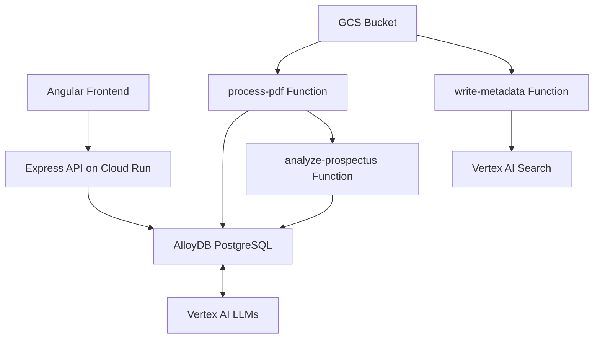

## Overview

GenWealth is a comprehensive demo application for a fictional financial services company that demonstrates how to build trustworthy Gen AI features into existing applications using AlloyDB AI, Vertex AI, Cloud Run, and Cloud Functions.


## Use Case: Knowledge Worker Assist

GenWealth implements three AI-powered features for investment advisory:

<CardGroup cols={3}>
  <Card title="Semantic Search" icon="magnifying-glass">
    Improve investment discovery using AlloyDB AI embeddings
  </Card>
  <Card title="Customer Segmentation" icon="users">
    Identify prospects for new products with vector similarity
  </Card>
  <Card title="RAG Chatbot" icon="comments">
    Financial advisor assistant grounded in application data
  </Card>
</CardGroup>

## Architecture

### System Components



### Database Schema

The GenWealth application uses a simple but powerful relational schema:


**Key Tables:**
- `investments`: Stock/ETF data with AI-generated analysis and embeddings
- `user_profiles`: Customer data with bio embeddings for segmentation
- `langchain_vector_store`: Document chunks from PDF ingestion
- `conversation_history`: Optional chat history for multi-turn conversations

## Tech Stack

<CardGroup cols={2}>
  <Card title="Database" icon="database">
    **AlloyDB for PostgreSQL 14+**
    - Native pgvector extension
    - Direct Vertex AI integration
    - Embeddings and LLM functions
  </Card>
  <Card title="AI Services" icon="brain">
    **Vertex AI**
    - gemini-2.0-flash-001
    - text-embedding-005
    - Agent Builder
  </Card>
  <Card title="Backend" icon="server">
    **TypeScript/Node.js**
    - Express REST API
    - Cloud Run (2nd gen)
    - Cloud Functions (Python 3.11+)
  </Card>
  <Card title="Frontend" icon="browser">
    **Angular 17+**
    - Material Design
    - Vertex AI Search widget
    - Real-time chat interface
  </Card>
</CardGroup>

### Supporting Services

- **Document AI**: OCR processor for PDF text extraction
- **Cloud Storage**: Document and metadata buckets
- **Eventarc**: Event-driven pipeline orchestration
- **Pub/Sub**: Asynchronous function invocation
- **Secret Manager**: Database credentials and API keys
- **LangChain**: Text chunking and vector store integration

## AlloyDB AI Integration

### Native Embeddings Generation

AlloyDB integrates directly with Vertex AI LLMs through the database engine:

```sql
-- Generate embeddings during INSERT/UPDATE
INSERT INTO investments (ticker, analysis, analysis_embedding)
VALUES (
  'AAPL',
  'Strong fundamentals with ecosystem lock-in...',
  google_ml.embedding('text-embedding-005', 'Strong fundamentals...')::vector
);
```

### Semantic Similarity Search

<CodeGroup>
```sql Inflation Hedge Search
-- Search for stocks that might perform well in high inflation
SELECT ticker, etf, rating, analysis,
  analysis_embedding <=> google_ml.embedding(
    'text-embedding-005', 
    'hedge against high inflation'
  )::vector AS distance
FROM investments
ORDER BY distance
LIMIT 5;
```

```sql Hybrid Search
-- Combine semantic search with structured filters
SELECT first_name, last_name, email, age, risk_profile, bio,
  bio_embedding <=> google_ml.embedding(
    'text-embedding-005', 
    'young aggressive investor'
  )::vector AS distance
FROM user_profiles
WHERE risk_profile = 'high'
  AND age BETWEEN 18 AND 50
ORDER BY distance
LIMIT 50;
```
</CodeGroup>

<Note>
The `<=>` operator calculates cosine distance. Lower values indicate higher similarity.
</Note>

### Text Generation in SQL

AlloyDB can invoke Gemini directly for text completion:

```sql
-- Financial chatbot with context and branding
SELECT llm_prompt, llm_response
FROM llm(
  -- User prompt
  prompt => 'I have $25250 to invest. What do you suggest?',
  
  -- Prompt enrichment
  llm_role => 'You are a financial chatbot named Penny',
  mission => 'Your mission is to assist your clients by providing financial education, account details, and basic information related to budgeting, saving, and different types of investments',
  output_instructions => 'Begin your response with a professional greeting. Greet me by name if you know it. End your response with a signature that includes your name and "GenWealth" company affiliation.',
  
  -- Optional parameters
  enable_history => true,  -- Maintain conversation context
  user_id => 'user123',    -- For history tracking
  model => 'gemini-2.0-flash-001'
);
```

## Document Ingestion Pipeline

The pipeline processes financial documents (prospectuses, 10-Ks, 10-Qs) dropped into Cloud Storage:

<Steps>
  <Step title="Upload Trigger">
    Upload PDF to `$PROJECT_ID-docs` bucket (named by ticker, e.g., `GOOG.pdf`)
  </Step>
  <Step title="Parallel Processing">
    Eventarc triggers two parallel branches:
    - **RAG Pipeline**: Custom processing for AlloyDB vector store
    - **Vertex AI Search Pipeline**: Automatic indexing with faceted search
  </Step>
  <Step title="RAG Pipeline: OCR & Chunking">
    `process-pdf` function:
    - Extracts text with Document AI OCR
    - Chunks text with LangChain
    - Generates embeddings with text-embedding-005
    - Writes to `langchain_vector_store` table
  </Step>
  <Step title="RAG Pipeline: Analysis">
    `analyze-prospectus` function:
    - Retrieves document chunks from AlloyDB
    - Generates company overview with Gemini
    - Creates investment analysis and rating
    - Saves to `investments` table with embeddings
  </Step>
  <Step title="Search Pipeline: Metadata & Indexing">
    - `write-metadata` function creates JSONL for faceted search
    - `update-search-index` function triggers re-indexing
    - Vertex AI Search makes document queryable
  </Step>
</Steps>

### Pipeline Performance

- **Processing time**: 1-10+ minutes depending on PDF size
- **Parallel documents**: Up to 5 by default (quota-dependent)
- **File limits**: Tested up to 15MB, 200 pages
- **Method**: Batch processing via Document AI

<CodeGroup>
```python process-pdf (Simplified)
import functions_framework
from google.cloud import documentai
from langchain.text_splitter import RecursiveCharacterTextSplitter
from langchain_google_alloydb_pg import AlloyDBVectorStore

@functions_framework.cloud_event
def process_pdf(cloud_event):
    # Extract text with Document AI
    document = documentai_client.process_document(
        request={"name": processor_name, "raw_document": raw_document}
    )
    text = document.text
    
    # Chunk with LangChain
    text_splitter = RecursiveCharacterTextSplitter(
        chunk_size=1000, chunk_overlap=100
    )
    chunks = text_splitter.split_text(text)
    
    # Store in AlloyDB with embeddings
    vector_store = AlloyDBVectorStore(
        engine=alloydb_engine,
        embedding_service=VertexAIEmbeddings(
            model_name="text-embedding-005"
        )
    )
    vector_store.add_texts(chunks, metadatas=[{"ticker": ticker}])
```

```python analyze-prospectus (Simplified)
@functions_framework.cloud_event
def analyze_prospectus(cloud_event):
    # Retrieve chunks from AlloyDB
    query = "SELECT content FROM langchain_vector_store WHERE ticker = %s"
    chunks = db.execute(query, (ticker,)).fetchall()
    
    # Generate overview
    overview_prompt = f"""Analyze this prospectus and provide:
    1. Company overview
    2. Key investment highlights
    3. Risk factors
    
    Document: {' '.join([c['content'] for c in chunks])}
    """
    overview = gemini_model.generate_content(overview_prompt).text
    
    # Generate analysis and rating
    analysis_prompt = f"""Based on this overview, provide:
    1. Investment analysis
    2. Buy/Sell/Hold rating with justification
    
    Overview: {overview}
    """
    analysis = gemini_model.generate_content(analysis_prompt).text
    rating = extract_rating(analysis)  # Parse rating from response
    
    # Save to investments table (embeddings auto-generated)
    query = """INSERT INTO investments 
               (ticker, overview, analysis, rating, analysis_embedding)
               VALUES (%s, %s, %s, %s, 
                 google_ml.embedding('text-embedding-005', %s)::vector)
            """
    db.execute(query, (ticker, overview, analysis, rating, analysis))
```
</CodeGroup>

## Middle Tier API

The Express/TypeScript backend provides REST endpoints:

```typescript
import express from 'express';
import { Database } from './Database';

const app: express.Application = express();
const db = new Database();

// Semantic search for investments
app.get('/api/investments/search', async (req, res) => {
  const { query } = req.query;
  
  const sql = `
    SELECT ticker, etf, rating, analysis,
      analysis_embedding <=> google_ml.embedding(
        'text-embedding-005', $1
      )::vector AS distance
    FROM investments
    ORDER BY distance
    LIMIT 10
  `;
  
  const results = await db.query(sql, [query]);
  res.json(results);
});

// Customer segmentation
app.post('/api/customers/segment', async (req, res) => {
  const { persona, riskProfile, ageMin, ageMax } = req.body;
  
  const sql = `
    SELECT first_name, last_name, email, age, risk_profile,
      bio_embedding <=> google_ml.embedding(
        'text-embedding-005', $1
      )::vector AS distance
    FROM user_profiles
    WHERE risk_profile = $2
      AND age BETWEEN $3 AND $4
    ORDER BY distance
    LIMIT 50
  `;
  
  const results = await db.query(sql, [persona, riskProfile, ageMin, ageMax]);
  res.json(results);
});

// RAG chatbot
app.post('/api/chat', async (req, res) => {
  const { prompt, userId } = req.body;
  
  const sql = `SELECT llm_prompt, llm_response FROM llm(
    prompt => $1,
    llm_role => 'You are a financial chatbot named Penny',
    mission => 'Assist clients with financial education and advice',
    output_instructions => 'Be professional and cite sources',
    enable_history => true,
    user_id => $2
  )`;
  
  const result = await db.query(sql, [prompt, userId]);
  res.json(result[0]);
});
```

## Frontend Features

### Investment Search Interface

- **Semantic search bar**: Natural language queries against investment data
- **Faceted filters**: Risk profile, asset type, sector
- **Results display**: Cards with analysis, rating, and similarity score
- **PDF viewer**: Inline prospectus viewing with Vertex AI Search widget

### Customer Segmentation Tool

- **Persona builder**: Describe ideal customer in natural language
- **Filter controls**: Risk profile, age range, investment goals
- **Match scoring**: Similarity distance visualization
- **Export options**: CSV download for marketing campaigns

### Financial Advisor Chatbot

- **Conversational UI**: Multi-turn chat with context preservation
- **Grounding visualization**: Shows retrieved documents used for responses
- **Citation links**: References to source prospectuses and data
- **History**: Persistent conversation across sessions

## Deployment

### Prerequisites

- Google Cloud project with billing enabled
- Cloud Shell or local terminal with gcloud CLI
- Public IP address for AlloyDB connection (during setup)

### Installation Steps

<Steps>
  <Step title="Clone Repository">
    ```bash
    cd ~
    git clone https://github.com/GoogleCloudPlatform/generative-ai.git
    cd generative-ai/gemini/sample-apps/genwealth/
    ```
  </Step>
  <Step title="Configure Environment">
    Edit `env.sh` with your settings:
    ```bash
    export REGION="us-central1"
    export ZONE="us-central1-a"
    export LOCAL_IPV4="X.X.X.X"  # Your public IP from ipv4.icanhazip.com
    ```
  </Step>
  <Step title="Run Installation Script">
    ```bash
    ./install.sh
    ```
    
    The script provisions:
    - AlloyDB cluster (zonal) with pgvector extension
    - Cloud Run service for Express API
    - Cloud Functions for document processing
    - GCS buckets for documents and metadata
    - Vertex AI Search app and datastore
    - Networking (VPC, PSC endpoints)
    - IAM roles and service accounts
    
    **Duration**: ~30-35 minutes
  </Step>
  <Step title="Configure Vertex AI Search">
    When prompted, retrieve the `configId`:
    1. Navigate to Vertex AI Search in console
    2. Accept terms and activate API
    3. Click Apps → search-prospectus → Integration
    4. Copy configId UUID (e.g., `4205ae6a-434e-695e-aee4-58f500bd9000`)
    5. Paste into installation prompt
  </Step>
  <Step title="Set Allowed Domain">
    After deployment completes:
    1. Copy the Cloud Run service URL
    2. In Vertex AI Search Integration settings, add domain without `https://` or trailing slash
    3. Save configuration
  </Step>
  <Step title="Access Application">
    Open the Cloud Run URL in your browser to explore the demo
  </Step>
</Steps>

### Post-Installation

Set AlloyDB password (if prompted during install):
```bash
source ./env.sh
gcloud secrets versions access latest --secret="alloydb-password"
```

## Troubleshooting

<AccordionGroup>
  <Accordion title="PDF viewing returns 412 error">
    Re-run bucket IAM binding:
    ```bash
    source ./env.sh
    gcloud storage buckets add-iam-policy-binding gs://${PROJECT_ID}-docs \
      --member=allUsers --role=roles/storage.objectViewer
    ```
  </Accordion>
  
  <Accordion title="Search widget shows 'not authorized' error">
    Ensure:
    1. Domain added to allowed list in Vertex AI Search Integration
    2. API terms accepted and activated
    3. No trailing slash in domain configuration
  </Accordion>
  
  <Accordion title="Document processing takes too long">
    Check:
    - Document AI quota limits
    - Cloud Function logs for errors: `gcloud functions logs read process-pdf`
    - File size (max 15MB recommended)
  </Accordion>
</AccordionGroup>

## Demo Walkthroughs

- [Front End Demo Walkthrough](https://github.com/GoogleCloudPlatform/generative-ai/blob/main/gemini/sample-apps/genwealth/walkthroughs/frontend-demo-walkthrough.md)
- [Back End Demo Walkthrough](https://github.com/GoogleCloudPlatform/generative-ai/blob/main/gemini/sample-apps/genwealth/walkthroughs/backend-demo-walkthrough.md)

## Customization & Extension

### Using Non-Vertex Models

See [alternate-configs/non-vertex-models.md](https://github.com/GoogleCloudPlatform/generative-ai/blob/main/gemini/sample-apps/genwealth/alternate-configs/non-vertex-models.md) for using open-source models.

### AlloyDB Omni Configuration

For on-premises deployment: [alternate-configs/alloydb-omni.md](https://github.com/GoogleCloudPlatform/generative-ai/blob/main/gemini/sample-apps/genwealth/alternate-configs/alloydb-omni.md)

### Custom Document Types

Modify `analyze-prospectus` function to handle different financial documents:
- Earnings reports
- Research papers
- Analyst ratings
- Market commentary

## Cleanup

<Warning>
Deleting the project permanently destroys all resources. Ensure you have backups of any data you need.
</Warning>

```bash
# Set your project ID
PROJECT_ID='your-project-id'
gcloud projects delete ${PROJECT_ID}
```

Alternatively, delete individual resources:
```bash
source ./env.sh

# Delete Cloud Run service
gcloud run services delete genwealth-ui --region=${REGION}

# Delete AlloyDB cluster
gcloud alloydb clusters delete genwealth-cluster --region=${REGION}

# Delete Cloud Functions
gcloud functions delete process-pdf --region=${REGION}
gcloud functions delete analyze-prospectus --region=${REGION}

# Delete Cloud Storage buckets
gcloud storage rm -r gs://${PROJECT_ID}-docs
gcloud storage rm -r gs://${PROJECT_ID}-docs-metadata
```

## Key Takeaways

<CardGroup cols={2}>
  <Card title="Database-Native AI" icon="database">
    AlloyDB's direct Vertex AI integration eliminates external API calls for embeddings and LLM inference
  </Card>
  <Card title="Hybrid Search" icon="search">
    Combine semantic similarity with structured filters for precise results
  </Card>
  <Card title="Event-Driven Pipelines" icon="rotate">
    Eventarc + Cloud Functions enable scalable, parallel document processing
  </Card>
  <Card title="Production Patterns" icon="shield">
    Secret Manager, IAM, VPC, and PSC provide enterprise-grade security
  </Card>
</CardGroup>

## Next Steps

- Explore the [FixMyCar RAG implementation](/sample-apps/fixmycar) with Vertex AI Search
- Learn about [Spanner's multi-modal search](/sample-apps/finance-advisor) capabilities
- Build [real-time voice AI](/sample-apps/live-telephony) with Gemini Live API