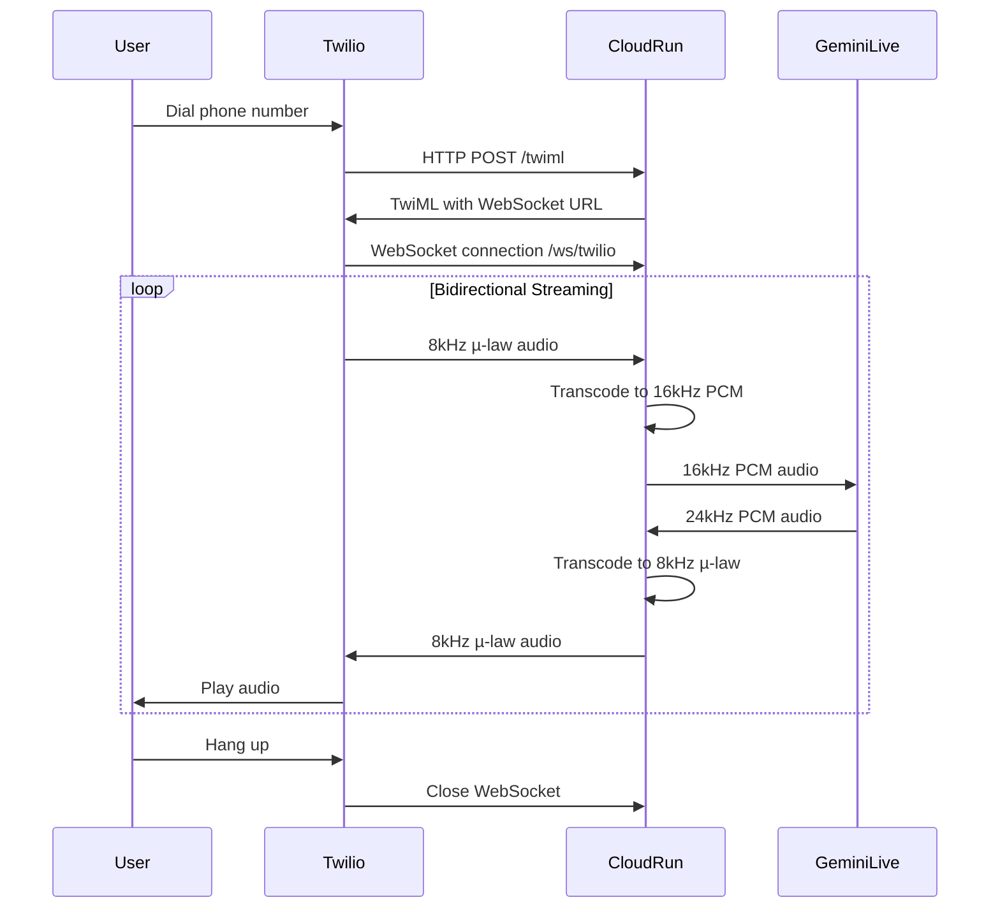

## Overview

The Gemini Live Telephony app demonstrates how to build a production-grade, real-time conversational AI system that operates over the phone. This application integrates Twilio for telephony, FastAPI for real-time processing, and the Google Gemini Live API for low-latency voice interactions.

<Note>
Originally built as an "AI Care Assistant," this architecture can be adapted for customer service, technical support, appointment scheduling, and other voice-based use cases.
</Note>

## Architecture

### High-Level Data Flow



### System Components

<CardGroup cols={2}>
  <Card title="Twilio Programmable Voice" icon="phone">
    - Phone number provisioning
    - TwiML webhook handling
    - Bidirectional audio streaming
    - µ-law codec (8kHz)
  </Card>
  <Card title="FastAPI Backend" icon="bolt">
    - Async WebSocket handling
    - Real-time audio transcoding
    - Session state management
    - Deployed on Cloud Run
  </Card>
  <Card title="Gemini Live API" icon="microphone">
    - Streaming audio input/output
    - Voice Activity Detection (VAD)
    - Conversation turn management
    - Session resumption
  </Card>
  <Card title="Audio Pipeline" icon="waveform">
    - 8kHz µ-law ↔ 16kHz PCM
    - 24kHz PCM ↔ 8kHz µ-law
    - High-fidelity resampling
    - Stateful DSP processing
  </Card>
</CardGroup>

## Audio Transcoding Pipeline

### The Critical Challenge

The application bridges three incompatible audio formats:

- **Twilio**: 8kHz µ-law (telephony standard)
- **Gemini Input**: 16kHz PCM (Live API requirement)
- **Gemini Output**: 24kHz PCM (high-quality voice synthesis)

<Warning>
Naive chunk-by-chunk resampling introduces audible artifacts. The solution requires **stateful streaming DSP**.
</Warning>

### Transcoding Architecture

```python
import numpy as np
import samplerate
import audioop
import base64

# Initialize stateful resamplers (critical for quality)
resampler_in = samplerate.Resampler('sinc_fastest', channels=1)
resampler_out = samplerate.Resampler('sinc_fastest', channels=1)

async def handle_twilio_to_gemini(websocket, in_q, resampler, call_state):
    """Inbound pipeline: Twilio → Gemini"""
    async for message in websocket.iter_text():
        data = json.loads(message)
        
        if data['event'] == 'media':
            # Step 1: Decode base64 µ-law from Twilio
            mulaw_audio = base64.b64decode(data['media']['payload'])
            
            # Step 2: Convert µ-law to 16-bit PCM
            pcm_8khz = audioop.ulaw2lin(mulaw_audio, 2)  # 2 = 16-bit
            
            # Step 3: Convert to float32 for resampling
            pcm_8khz_float = np.frombuffer(pcm_8khz, dtype=np.int16).astype(np.float32) / 32768.0
            
            # Step 4: Resample 8kHz → 16kHz with stateful resampler
            pcm_16khz_float = resampler.process(
                pcm_8khz_float,
                ratio=16000/8000,
                end_of_input=False  # Critical: maintains filter state
            )
            
            # Step 5: Convert back to int16 PCM bytes
            pcm_16khz_int16 = (pcm_16khz_float * 32768.0).astype(np.int16)
            pcm_16khz_bytes = pcm_16khz_int16.tobytes()
            
            # Step 6: Send to Gemini Live API
            await in_q.put(pcm_16khz_bytes)

async def handle_gemini_to_twilio(websocket, out_q, resampler, call_state):
    """Outbound pipeline: Gemini → Twilio"""
    while call_state['active']:
        # Step 1: Receive 24kHz PCM from Gemini
        pcm_24khz_bytes = await out_q.get()
        
        # Step 2: Convert to float32
        pcm_24khz_float = np.frombuffer(pcm_24khz_bytes, dtype=np.int16).astype(np.float32) / 32768.0
        
        # Step 3: Resample 24kHz → 8kHz
        pcm_8khz_float = resampler.process(
            pcm_24khz_float,
            ratio=8000/24000,
            end_of_input=False
        )
        
        # Step 4: Convert to int16 PCM
        pcm_8khz_int16 = (pcm_8khz_float * 32768.0).astype(np.int16)
        pcm_8khz_bytes = pcm_8khz_int16.tobytes()
        
        # Step 5: Convert PCM to µ-law
        mulaw_audio = audioop.lin2ulaw(pcm_8khz_bytes, 2)
        
        # Step 6: Encode to base64 and send to Twilio
        mulaw_b64 = base64.b64encode(mulaw_audio).decode('utf-8')
        await websocket.send_text(json.dumps({
            "event": "media",
            "streamSid": call_state['stream_sid'],
            "media": {"payload": mulaw_b64}
        }))
```

### Why `python-samplerate`?

The application uses `samplerate` (libsamplerate wrapper) instead of `scipy.signal.resample`:

<CardGroup cols={2}>
  <Card title="Stateful Processing" icon="memory">
    Maintains filter state across chunks to prevent discontinuities
  </Card>
  <Card title="Low Latency" icon="gauge-high">
    Optimized for real-time streaming with minimal buffering
  </Card>
  <Card title="High Fidelity" icon="music">
    SRC_SINC_FASTEST provides excellent quality-to-speed ratio
  </Card>
  <Card title="Production Ready" icon="shield">
    Battle-tested in audio production and telephony systems
  </Card>
</CardGroup>

## Gemini Live API Integration

### Session Configuration

```python
from google import genai
from google.genai import types

# Initialize Gemini client with Vertex AI
client = genai.Client(
    vertexai=True,
    project=os.getenv("GOOGLE_CLOUD_PROJECT"),
    location=os.getenv("GOOGLE_CLOUD_LOCATION"),
)

# Configure Live session
config = types.LiveConnectConfig(
    system_instruction=BASE_SYSTEM_INSTRUCTION,
    
    # Voice configuration
    voice_config={
        "prebuilt_voice_config": {
            "voice_name": "Puck"  # Options: Puck, Charon, Kore, Fenrir, Aoede
        }
    },
    
    # Audio settings
    generation_config={
        "temperature": 0.7,
        "top_p": 0.9,
        "top_k": 40,
    },
    
    # Real-time input configuration
    real_time_input={
        "enable_explicit_conversation_turn": False  # Continuous conversation
    },
    
    # Voice Activity Detection
    speech_config={
        "voice_activity_detection": {
            "mode": "AUTO"  # Automatic turn-taking
        }
    }
)
```

### Session Management

<CodeGroup>
```python Session Lifecycle
async def run_gemini_session(client, model_id, in_q, out_q, call_state):
    """Manage persistent Gemini Live session"""
    session_handle = None  # For session resumption
    
    try:
        async with client.aio.live.connect(
            model=model_id,
            config=config,
            resume_handle=session_handle  # Resume if reconnecting
        ) as session:
            
            # Start concurrent tasks
            sender_task = asyncio.create_task(
                sender_loop(session, in_q, call_state)
            )
            heartbeat_task = asyncio.create_task(
                heartbeat_loop(session, call_state)
            )
            
            # Main receiver loop
            async for response in session.receive():
                if response.server_content:
                    # Audio output from Gemini
                    if response.server_content.model_turn:
                        for part in response.server_content.model_turn.parts:
                            if part.inline_data:
                                audio_data = part.inline_data.data
                                await out_q.put(audio_data)
                
                elif response.session_resumption_update:
                    # Save session handle for reconnection
                    session_handle = response.session_resumption_update.new_handle
                    logger.info(f"Session handle updated: {session_handle[:20]}...")
            
            # Cleanup
            sender_task.cancel()
            heartbeat_task.cancel()
    
    except Exception as e:
        logger.error(f"Gemini session error: {e}")
        call_state['active'] = False
```

```python Audio Sender
async def sender_loop(session, in_q, call_state):
    """Send audio from Twilio to Gemini"""
    while call_state['active']:
        try:
            audio_chunk = await asyncio.wait_for(in_q.get(), timeout=0.1)
            
            # Send audio to Gemini
            await session.send(
                types.LiveClientContent(
                    realtime_input=types.LiveClientRealtimeInput(
                        media_chunks=[
                            types.BlobPart(
                                inline_data=types.Blob(
                                    mime_type="audio/pcm",
                                    data=audio_chunk
                                )
                            )
                        ]
                    )
                ),
                end_of_turn=False  # Continuous streaming
            )
        
        except asyncio.TimeoutError:
            continue
        except Exception as e:
            logger.error(f"Sender error: {e}")
            break
```

```python Heartbeat
async def heartbeat_loop(session, call_state):
    """Keep session alive during silence"""
    while call_state['active']:
        await asyncio.sleep(5.0)
        
        try:
            # Send empty message to prevent timeout
            await session.send(
                types.LiveClientContent(
                    realtime_input=types.LiveClientRealtimeInput(
                        media_chunks=[]
                    )
                )
            )
        except Exception as e:
            logger.warning(f"Heartbeat failed: {e}")
```
</CodeGroup>

### Voice Activity Detection (VAD)

Gemini Live API's VAD automatically detects:

- **Speech start**: User begins speaking
- **Speech end**: User stops speaking
- **Turn-taking**: When to let AI respond

```python
# Configure VAD sensitivity
speech_config={
    "voice_activity_detection": {
        "mode": "AUTO",  # or "MANUAL"
        "threshold": 0.5  # Sensitivity: 0.0 (aggressive) to 1.0 (conservative)
    }
}
```

## FastAPI WebSocket Handler

```python
from fastapi import FastAPI, WebSocket, Response
import asyncio

app = FastAPI(title="Gemini Live Telephony")

@app.post("/twiml")
async def get_twiml():
    """Twilio webhook: Return TwiML to establish WebSocket"""
    service_url = os.getenv("SERVICE_URL").replace("https://", "")
    
    twiml = f'''<Response>
        <Connect>
            <Stream url="wss://{service_url}/ws/twilio" />
        </Connect>
    </Response>'''
    
    return Response(content=twiml, media_type="application/xml")

@app.websocket("/ws/twilio")
async def websocket_twilio_endpoint(websocket: WebSocket):
    """Main WebSocket endpoint for Twilio media streams"""
    await websocket.accept()
    
    # Initialize state
    call_state = {
        'active': False,
        'stream_sid': None
    }
    
    # Create queues for audio flow
    in_q = asyncio.Queue()   # Twilio → Gemini
    out_q = asyncio.Queue()  # Gemini → Twilio
    
    # Initialize stateful resamplers
    resampler_in = samplerate.Resampler('sinc_fastest', channels=1)
    resampler_out = samplerate.Resampler('sinc_fastest', channels=1)
    
    # Start concurrent tasks
    tasks = [
        asyncio.create_task(
            handle_twilio_to_gemini(websocket, in_q, resampler_in, call_state)
        ),
        asyncio.create_task(
            handle_gemini_to_twilio(websocket, out_q, resampler_out, call_state)
        ),
        asyncio.create_task(
            run_gemini_session(client, MODEL_ID, in_q, out_q, call_state)
        ),
    ]
    
    try:
        # Wait for any task to complete (typically on hangup)
        await asyncio.wait(tasks, return_when=asyncio.FIRST_COMPLETED)
    finally:
        # Cleanup
        call_state['active'] = False
        for task in tasks:
            task.cancel()
        
        logger.info("Call ended, resources cleaned up")
```

## Cloud Run Deployment

### Critical Configuration

```bash
#!/bin/bash
# deploy.sh

PROJECT_ID="your-project-id"
REGION="us-central1"
SERVICE_NAME="gemini-live-telephony"
IMAGE="gcr.io/${PROJECT_ID}/${SERVICE_NAME}:latest"

# Build container
docker build -t ${IMAGE} .
docker push ${IMAGE}

# Deploy to Cloud Run with production settings
gcloud run deploy ${SERVICE_NAME} \
  --image ${IMAGE} \
  --region ${REGION} \
  --platform managed \
  --allow-unauthenticated \
  \
  `# Critical settings for low-latency voice` \
  --min-instances=1 \
  --max-instances=100 \
  --timeout=3600 \
  --memory=2Gi \
  --cpu=2 \
  --concurrency=1 \
  --session-affinity \
  --no-cpu-throttling \
  \
  `# Environment variables` \
  --set-env-vars="GOOGLE_CLOUD_PROJECT=${PROJECT_ID}" \
  --set-env-vars="GOOGLE_CLOUD_LOCATION=${REGION}" \
  --set-env-vars="GOOGLE_GENAI_MODEL=gemini-2.0-flash-native-audio" \
  --set-env-vars="SERVICE_URL=https://SERVICE_URL_PLACEHOLDER"

# Get service URL
SERVICE_URL=$(gcloud run services describe ${SERVICE_NAME} \
  --region=${REGION} \
  --format='value(status.url)')

echo "Service URL: ${SERVICE_URL}"
echo "Configure Twilio webhook: ${SERVICE_URL}/twiml"
```

### Configuration Rationale

<CardGroup cols={2}>
  <Card title="min-instances=1" icon="server">
    Eliminates cold starts. Critical for phone calls - users won't wait 10s for first response.
  </Card>
  <Card title="concurrency=1" icon="user">
    Each instance handles one call. Prevents resource contention for CPU-intensive audio processing.
  </Card>
  <Card title="session-affinity" icon="link">
    Routes WebSocket reconnections to same instance, preserving in-memory resampler state.
  </Card>
  <Card title="no-cpu-throttling" icon="gauge">
    Ensures full CPU access. Audio resampling is latency-sensitive and CPU-bound.
  </Card>
  <Card title="timeout=3600" icon="clock">
    1-hour timeout for long calls. WebSocket connections must persist for call duration.
  </Card>
  <Card title="memory=2Gi, cpu=2" icon="memory">
    Sufficient resources for real-time DSP without swapping or throttling.
  </Card>
</CardGroup>

### Dockerfile

```dockerfile
FROM python:3.12-slim

# Install system dependencies for audio processing
RUN apt-get update && apt-get install -y \
    libsamplerate0 \
    && rm -rf /var/lib/apt/lists/*

WORKDIR /app

# Install Python dependencies
COPY requirements.txt .
RUN pip install --no-cache-dir -r requirements.txt

# Copy application code
COPY . .

# Run with uvicorn
CMD ["uvicorn", "main:app", "--host", "0.0.0.0", "--port", "8000"]
```

## Twilio Configuration

<Steps>
  <Step title="Create Twilio Account">
    Sign up at [twilio.com/try-twilio](https://www.twilio.com/try-twilio) for free trial
  </Step>
  
  <Step title="Get Phone Number">
    Navigate to Phone Numbers → Buy a Number. Choose a number with Voice capabilities.
  </Step>
  
  <Step title="Configure Webhook">
    1. Go to Phone Numbers → Manage → Active Numbers
    2. Click your phone number
    3. Under "Voice & Fax", set:
       - **A CALL COMES IN**: Webhook
       - **URL**: `https://YOUR_CLOUD_RUN_URL/twiml`
       - **HTTP Method**: POST
    4. Save configuration
  </Step>
  
  <Step title="Test Call">
    Dial your Twilio number. You should hear the Gemini Live voice assistant respond.
  </Step>
</Steps>

## Local Development with ngrok

For local testing before Cloud Run deployment:

<Steps>
  <Step title="Install ngrok">
    Download from [ngrok.com/download](https://ngrok.com/download)
  </Step>
  
  <Step title="Start Local Server">
    ```bash
    uvicorn main:app --host 0.0.0.0 --port 8000
    ```
  </Step>
  
  <Step title="Expose with ngrok">
    ```bash
    ngrok http 8000
    ```
    
    Copy the forwarding URL (e.g., `https://abc123.ngrok-free.app`)
  </Step>
  
  <Step title="Update Environment">
    ```bash
    # In .env file
    SERVICE_URL=https://abc123.ngrok-free.app
    ```
    
    Restart FastAPI server to load new URL.
  </Step>
  
  <Step title="Configure Twilio">
    Set webhook to `https://abc123.ngrok-free.app/twiml`
  </Step>
  
  <Step title="Test">
    Call Twilio number. Watch real-time logs in your terminal.
  </Step>
</Steps>

## Monitoring & Debugging

### Cloud Logging

```bash
# Stream logs from Cloud Run
gcloud logging tail "resource.type=cloud_run_revision AND resource.labels.service_name=gemini-live-telephony" --format=json

# Filter for errors
gcloud logging read "resource.type=cloud_run_revision AND severity>=ERROR" --limit 50
```

### Key Metrics to Monitor

- **WebSocket duration**: Should match call length
- **Audio queue depths**: `in_q.qsize()`, `out_q.qsize()` should stay < 10
- **Resampler latency**: Process time per chunk should be < 5ms
- **Gemini API latency**: Time from audio input to output
- **Cold start frequency**: Should be 0 with `min-instances=1`

### Common Issues

<AccordionGroup>
  <Accordion title="Audio is choppy or distorted">
    Check:
    - Resampler state is preserved (not recreated per chunk)
    - Queue depths are reasonable
    - CPU throttling disabled in Cloud Run
    - No GC pauses (use `gc.set_threshold()` tuning)
  </Accordion>
  
  <Accordion title="High latency (> 500ms)">
    Verify:
    - `min-instances=1` to avoid cold starts
    - Cloud Run region close to users
    - No network egress throttling
    - Gemini Live API location matches Cloud Run region
  </Accordion>
  
  <Accordion title="Session drops mid-call">
    Possible causes:
    - Missing heartbeat loop
    - Timeout < call duration
    - Session handle not preserved
    - WebSocket disconnection without reconnect logic
  </Accordion>
  
  <Accordion title="Twilio webhook fails">
    Check:
    - SERVICE_URL environment variable is correct
    - Cloud Run service allows unauthenticated requests
    - TwiML response is valid XML
    - WebSocket URL uses `wss://` not `ws://`
  </Accordion>
</AccordionGroup>

## Production Considerations

### State Management

For production, externalize conversation state to Redis:

```python
import redis.asyncio as redis

# Initialize Redis client
redis_client = redis.from_url(
    "redis://MEMORYSTORE_IP:6379",
    decode_responses=True
)

async def save_session_handle(call_sid: str, handle: str):
    """Save session handle for resumption"""
    await redis_client.setex(
        f"session:{call_sid}",
        3600,  # 1 hour TTL
        handle
    )

async def get_session_handle(call_sid: str) -> str:
    """Retrieve session handle"""
    return await redis_client.get(f"session:{call_sid}")
```

### Security Enhancements

```python
from fastapi import Header, HTTPException
import hmac
import hashlib

def verify_twilio_signature(signature: str, url: str, params: dict):
    """Verify Twilio webhook signature"""
    auth_token = os.getenv("TWILIO_AUTH_TOKEN")
    
    # Construct signature
    data = url + ''.join([f"{k}{v}" for k, v in sorted(params.items())])
    expected = base64.b64encode(
        hmac.new(
            auth_token.encode('utf-8'),
            data.encode('utf-8'),
            hashlib.sha256
        ).digest()
    ).decode('utf-8')
    
    if not hmac.compare_digest(expected, signature):
        raise HTTPException(status_code=403, detail="Invalid signature")

@app.post("/twiml")
async def get_twiml(x_twilio_signature: str = Header(None)):
    # Verify signature before processing
    verify_twilio_signature(x_twilio_signature, request.url, request.form)
    # ... rest of handler
```

### Cost Optimization

```bash
# Use Cloud Run with traffic splitting for A/B testing
gcloud run services update-traffic gemini-live-telephony \
  --to-revisions=v1=50,v2=50

# Set max-instances to control peak cost
gcloud run services update gemini-live-telephony \
  --max-instances=50  # Caps at 50 concurrent calls

# Use Committed Use Discounts for predictable workloads
gcloud compute commitments create telephony-cud \
  --resources=vcpu=100,memory=200GB \
  --plan=12-month
```

## Key Takeaways

<CardGroup cols={2}>
  <Card title="Stateful Resampling" icon="waveform">
    Use python-samplerate with persistent resampler objects to avoid audio artifacts
  </Card>
  <Card title="Cloud Run for Voice" icon="cloud">
    Configure min-instances=1, concurrency=1, no-cpu-throttling for low latency
  </Card>
  <Card title="Session Resumption" icon="rotate">
    Preserve Gemini session handles for seamless reconnection
  </Card>
  <Card title="Production State" icon="database">
    Externalize state to Memorystore for horizontal scaling
  </Card>
</CardGroup>

## Next Steps

- Explore [GenWealth's RAG chatbot](/sample-apps/genwealth)
- Learn about [FixMyCar's document search](/sample-apps/fixmycar)
- Try [Spanner's multi-modal queries](/sample-apps/finance-advisor)

## Resources

- [Design Document (Detailed)](https://github.com/GoogleCloudPlatform/generative-ai/blob/main/gemini/sample-apps/gemini-live-telephony-app/design_doc.md)
- [Gemini Live API Documentation](https://cloud.google.com/vertex-ai/generative-ai/docs/multimodal/live-api)
- [Twilio Media Streams](https://www.twilio.com/docs/voice/twiml/stream)
- [Cloud Run Best Practices](https://cloud.google.com/run/docs/best-practices)