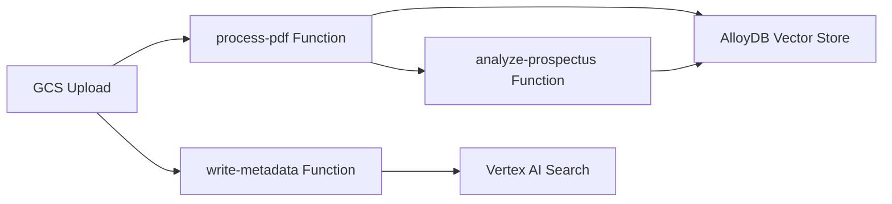

## Introduction

The Gemini sample apps showcase end-to-end, production-ready implementations of generative AI applications on Google Cloud. Each application demonstrates real-world architectures, integration patterns, and best practices for building AI-powered solutions.

## Featured Sample Applications

<CardGroup cols={2}>
  <Card title="GenWealth" icon="building-columns" href="/sample-apps/genwealth">
    Financial advisory platform with AlloyDB AI, semantic search, and RAG chatbot
  </Card>
  <Card title="FixMyCar" icon="car" href="/sample-apps/fixmycar">
    Automotive assistant using RAG with Vertex AI Search on GKE
  </Card>
  <Card title="Finance Advisor" icon="chart-line" href="/sample-apps/finance-advisor">
    Multi-modal search with Spanner's full-text, vector, and graph capabilities
  </Card>
  <Card title="Live Telephony" icon="phone" href="/sample-apps/live-telephony">
    Real-time voice AI with Gemini Live API and Twilio integration
  </Card>
</CardGroup>

## Common Architecture Patterns

### Database-Integrated AI

Multiple sample apps demonstrate how to leverage database-native AI capabilities:

- **AlloyDB AI** (GenWealth): Semantic search and embeddings directly in PostgreSQL
- **Spanner ML** (Finance Advisor): Full-text search, vector similarity, and graph traversal
- **Vertex AI Search** (FixMyCar): Managed search with OCR and document processing

### RAG Implementation Strategies

All sample apps implement Retrieval-Augmented Generation with different approaches:

<CodeGroup>
```sql AlloyDB Semantic Search
-- Hybrid search combining embeddings with filters
SELECT first_name, last_name, email, age, risk_profile, bio,
  bio_embedding <=> google_ml.embedding('text-embedding-005', 
    'young aggressive investor')::vector AS distance
FROM user_profiles
WHERE risk_profile = 'high'
  AND age BETWEEN 18 AND 50
ORDER BY distance
LIMIT 50;
```

```sql Spanner Multi-Modal Search
-- ANN search with full-text filtering
SELECT fund_name, investment_strategy, investment_managers,
  APPROX_EUCLIDEAN_DISTANCE(investment_strategy_Embedding_vector, 
    @vector, options => JSON '{"num_leaves_to_search": 10}') AS distance
FROM EU_MutualFunds @{force_index = InvestmentStrategyEmbeddingIndex}
WHERE investment_strategy_Embedding_vector IS NOT NULL
ORDER BY distance
LIMIT 100;
```

```java Vertex AI Search Integration
// Discovery Engine API for RAG
SearchRequest request = SearchRequest.newBuilder()
  .setServingConfig(ServingConfigName.format(
    projectId, location, collectionId, datastoreId, servingConfigId))
  .setQuery(searchQuery)
  .setPageSize(10)
  .build();
SearchResponse response = searchServiceClient.search(request)
  .getPage().getResponse();
```
</CodeGroup>

### Deployment Architectures

Sample apps demonstrate various deployment patterns:

| Application | Runtime | Key Components |
|------------|---------|----------------|
| GenWealth | Cloud Run | AlloyDB, Cloud Functions, Eventarc |
| FixMyCar | GKE Autopilot | Vertex AI Search, Java Spring |
| Finance Advisor | Cloud Run | Spanner, Streamlit |
| Live Telephony | Cloud Run | FastAPI, Twilio, Gemini Live API |

## Tech Stack Overview

### AI & ML Services

- **Gemini Models**: 2.0 Flash for text/multimodal generation
- **Vertex AI Embeddings**: text-embedding-005, textembeddings-gecko@003
- **Vertex AI Search**: Document AI OCR processor integration
- **Gemini Live API**: Real-time streaming audio/voice

### Data & Storage

- **AlloyDB for PostgreSQL**: Vector embeddings, LLM integration
- **Cloud Spanner**: Full-text search, vector indexes, graph queries
- **Cloud Storage**: Document ingestion pipelines
- **Vertex AI Vector Search**: Managed ANN search

### Application Frameworks

- **Frontend**: Angular, Streamlit, React
- **Backend**: TypeScript/Node, Java Spring Boot, Python FastAPI
- **Orchestration**: Cloud Functions, Eventarc, Pub/Sub

## Document Processing Pipelines

GenWealth and FixMyCar showcase automated document ingestion:

<Steps>
  <Step title="Document Upload">
    Upload PDFs to Cloud Storage bucket
  </Step>
  <Step title="OCR Processing">
    Document AI extracts text with layout preservation
  </Step>
  <Step title="Chunking & Embedding">
    LangChain splits text and generates embeddings
  </Step>
  <Step title="Vector Storage">
    Store in AlloyDB or Vertex AI Search datastore
  </Step>
  <Step title="Analysis & Enrichment">
    Generate summaries and structured metadata with Gemini
  </Step>
</Steps>

### GenWealth Pipeline Architecture



## Conversational AI Patterns

### Stateful Chat Management

<CodeGroup>
```sql AlloyDB Conversation History
-- Store and retrieve chat context
SELECT llm_prompt, llm_response
FROM llm(
  prompt => 'I have $25250 to invest. What do you suggest?',
  llm_role => 'You are a financial chatbot named Penny',
  mission => 'Assist clients with financial education and advice',
  enable_history => true
);
```

```python Gemini Live Session
# Real-time bidirectional audio streaming
async def run_gemini_session(client, model_id, in_q, out_q, call_state):
    config = LiveConnectConfig(
        system_instruction=BASE_SYSTEM_INSTRUCTION,
        voice_config={"prebuilt_voice_config": {"voice_name": "Puck"}},
        real_time_input={"enable_explicit_conversation_turn": False}
    )
    async with client.aio.live.connect(model=model_id, config=config) as session:
        # Handle bidirectional audio streams
```
</CodeGroup>

## Getting Started

<Note>
Each sample app is designed as an isolated demo environment. They are **not production-hardened** and should be customized for security, reliability, and scale before production deployment.
</Note>

### Prerequisites

- Google Cloud project with billing enabled
- Vertex AI API enabled
- Cloud Shell or local gcloud CLI
- Docker for container builds (where applicable)

### Common Setup Pattern

<Steps>
  <Step title="Clone Repository">
    ```bash
    git clone https://github.com/GoogleCloudPlatform/generative-ai.git
    cd generative-ai/gemini/sample-apps/
    ```
  </Step>
  <Step title="Choose Sample App">
    Navigate to specific app directory (genwealth, fixmycar, etc.)
  </Step>
  <Step title="Configure Environment">
    Update environment variables in env.sh or .env file
  </Step>
  <Step title="Run Installation Script">
    Execute automated deployment script (typically takes 20-35 minutes)
  </Step>
  <Step title="Explore Features">
    Access deployed UI and experiment with AI capabilities
  </Step>
</Steps>

## Performance & Scale Considerations

### Latency Optimization

- **GenWealth**: AlloyDB private service connect for sub-10ms queries
- **FixMyCar**: GKE Autopilot autoscaling with Vertex AI Search caching
- **Live Telephony**: Cloud Run min-instances=1, session affinity, CPU throttling disabled

### Cost Management

- Use AlloyDB zonal instances for dev/test (production should be regional)
- GKE Autopilot scales to zero when idle
- Cloud Run scales based on concurrency settings
- Vertex AI Search pricing based on queries and data volume

## Architecture Decision Records

### Why AlloyDB over Cloud SQL for GenWealth?

- Native vector similarity search with pgvector
- Direct Vertex AI LLM integration via `google_ml` extension
- Superior performance for OLTP + analytics hybrid workloads
- Built-in embeddings generation without external API calls

### Why GKE for FixMyCar?

- Java Spring Boot application with custom resource requirements
- Persistent connections to Vertex AI Search
- Service mesh capabilities for observability
- Workload Identity for fine-grained IAM

### Why Spanner for Finance Advisor?

- Multi-modal search: full-text, semantic (vector), and graph in single query
- Unlimited scale for global financial services workloads
- Strong consistency with 99.999% availability
- Native graph support for fund-of-funds relationships

## Next Steps

<CardGroup cols={2}>
  <Card title="Deploy GenWealth" icon="rocket" href="/sample-apps/genwealth">
    Build a trustworthy financial advisor with AlloyDB AI
  </Card>
  <Card title="Explore FixMyCar" icon="wrench" href="/sample-apps/fixmycar">
    Implement RAG for automotive troubleshooting
  </Card>
  <Card title="Try Finance Advisor" icon="database" href="/sample-apps/finance-advisor">
    Experience Spanner's multi-modal search capabilities
  </Card>
  <Card title="Voice AI with Telephony" icon="microphone" href="/sample-apps/live-telephony">
    Build real-time conversational AI over the phone
  </Card>
</CardGroup>

## Additional Resources

- [Vertex AI Documentation](https://cloud.google.com/vertex-ai/docs)
- [AlloyDB AI Documentation](https://cloud.google.com/alloydb/docs/ai)
- [Gemini API Reference](https://cloud.google.com/vertex-ai/generative-ai/docs/model-reference/gemini)
- [Sample Apps GitHub Repository](https://github.com/GoogleCloudPlatform/generative-ai/tree/main/gemini/sample-apps)